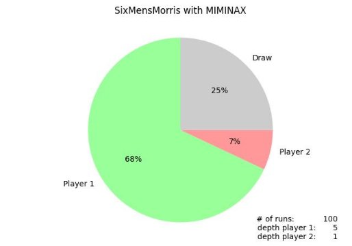

` `**WSTĘP DO SZTUCZNEJ INTELIGENCJI** 

LABORATORIUM 3 – RAPORT 

Student:  **Hubert Groen**   307866** Data:   **13.04.2023** 

1. **ALGORYTM MINIMAX Z OBCINANIEM α – β** 

Algorytm minimax pozwalana wyznaczanie wartości funkcji oceny dla poszczególnych stanów gry, wybiegając na *d* ruchów do przodu (głębokość). Algorytm działa rekursywnie aż do głębokości *d* lub znalezienia węzła terminalnego (koniec gry). Co drugą iterację preferowana jest maksymalna wartość funkcji oceny spośród dostępnych ruchów, a naprzemiennie jej minimalna wartość (symulowanie optymalnych ruchów przeciwnika. 

Wersja algorytmu minimax z obcinaniem α – β, zapamiętuje ruch z najlepszą dotychczas pożądaną wartością (maksymalną / minimalną) i nie zagłębia się w ruchu, których przeciwnik i tak nie wykona (jeśli  gra  optymalnie),  ponieważ  są  dla  niego  niekorzystne.  Taka  metoda  pozwala  na  znaczne przyspieszenie, przeszukiwanie. W Tabeli 1 zaprezentowano czasy symulacji rozgrywki dla algorytmu minimax z i bez odcinania α – β (komentując linijki za to odpowiedzialne – Fig.1): 

*Fig.  1. Wyłącznie obcinanie alfa-beta.* 

*Tabela 1. Czasu działania algorytmu minimax bez i z obcinaniem alfa-beta.* 

|GŁĘBOKOŚĆ (dla obydwu graczy) |czas MINIMAX  [s] |czas MINIMAX α – β  [s] |
| :- | :-: | :-: |
|1 |0\.01 |0\.01 |
|2 |1\.11 |1\.46 |
|3 |12\.49 |3\.73 |
|4 |113\.29 |15\.07 |
|5 |1117\.26 (około 19 minut) |37\.09 |

Jak widać wpływ obcinania alfa-beta na szybkość działania, szczególnie dla większych głębokości, jest ogromny. Algorytm alfa-beta pozwala na „osiągnięcie równowagi” pomiędzy dokładnością obliczeń  a kosztem czasowym. 

2. **WPŁYW GŁĘBOKOŚCI PRZESZUKIWANIA** 

Przy  niewystarczającej  głębokości  przeszukiwania,  algorytm  może  przeoczyć  optymalne  ruchy  i doprowadzić do niekorzystnego wyniku. Z kolei, zbyt duża głębokość przeszukiwania może prowadzić do zbyt długiego czasu obliczeń i znacznie spowolnić działanie algorytmu. 

Oto przykład dla dużej różnicy głębokości pomiędzy graczami (5 i 1), jak widać statycznie, większa głębokość zwiększa szansę na wygraną: 

*Fig.  2. Statystyki rezultatów dla przykładowych głębokości przeszukiwań.* 

|%  zwycięstw gracza 1 |%  remisów |%  zwycięstw gracza 2 |
| - | - | - |

*Tabela 2. Statystyki rezultatów algorytmu dla różnych kombinacji głębokości przeszukiwania.* 

<table><tr><th colspan="17">GRACZ 2 </th></tr>
<tr><td colspan="2" valign="top">1 </td><td colspan="3" valign="top">2 </td><td colspan="4" valign="top">3 </td><td colspan="4" valign="top">4 </td><td colspan="4" valign="top">5 </td></tr>
<tr><td colspan="1" rowspan="5">GRACZ 1 </td><td colspan="2">1 </td><td colspan="1">22 </td><td colspan="2">41 </td><td colspan="1">37 </td><td colspan="1">29 </td><td colspan="2">32 </td><td colspan="1">39 </td><td colspan="1">33 </td><td colspan="2">23 </td><td colspan="1">44 </td><td colspan="1">17 </td><td colspan="2">21 </td><td colspan="1">62 </td><td colspan="1">10 </td><td colspan="1">18 </td><td colspan="1">72 </td></tr>
<tr><td colspan="2">2 </td><td colspan="1">29 </td><td colspan="2">65 </td><td colspan="1">6 </td><td colspan="1">26 </td><td colspan="2">52 </td><td colspan="1">22 </td><td colspan="1">11 </td><td colspan="2">68 </td><td colspan="1">21 </td><td colspan="1">16 </td><td colspan="2">40 </td><td colspan="1">44 </td><td colspan="1">7 </td><td colspan="1">22 </td><td colspan="1">71 </td></tr>
<tr><td colspan="2">3 </td><td colspan="1">51 </td><td colspan="2">33 </td><td colspan="1">16 </td><td colspan="1">19 </td><td colspan="2">72 </td><td colspan="1">9 </td><td colspan="1">46 </td><td colspan="2">38 </td><td colspan="1">16 </td><td colspan="1">26 </td><td colspan="2">58 </td><td colspan="1">16 </td><td colspan="1">10 </td><td colspan="1">38 </td><td colspan="1">52 </td></tr>
<tr><td colspan="2">4 </td><td colspan="1">54 </td><td colspan="2">17 </td><td colspan="1">29 </td><td colspan="1">42 </td><td colspan="2">38 </td><td colspan="1">20 </td><td colspan="1">41 </td><td colspan="2">15 </td><td colspan="1">44 </td><td colspan="1">27 </td><td colspan="2">23 </td><td colspan="1">50 </td><td colspan="1">58 </td><td colspan="1">20 </td><td colspan="1">22 </td></tr>
<tr><td colspan="2">5 </td><td colspan="1">68 </td><td colspan="2">25 </td><td colspan="1">7 </td><td colspan="1">45 </td><td colspan="2">38 </td><td colspan="1">17 </td><td colspan="1">61 </td><td colspan="2">25 </td><td colspan="1">15 </td><td colspan="1">35 </td><td colspan="2">39 </td><td colspan="1">26 </td><td colspan="1">33 </td><td colspan="1">46 </td><td colspan="1">21 </td></tr>
</table>

Analizując Tabelę 2 widać minimalny wpływ algorytmu minimax na rezultaty rozgrywek – zazwyczaj wygrywa  gracz  z  dużo  większą  głębokością  przeszukiwań  (lewy  dolny  i  prawy  górny  róg).  Jednak  w ujęciu jednostkowym, nie są to wyniki zadowalające. Czynnikiem, który ma tu największy wpływ jest funkcja heurystyczna, zwracająca wartość dla węzłów quasi-terminalnych (czyli dojścia na wyznaczoną głębokość). Podaje ona jedynie różnicę pionków dwóch graczy. By ulepszyć funkcję oceny, można rozważyć dodanie dodatkowych punktów za „strategiczne” pozycje lub 2 pionki obok siebie (młynek możliwy w jednym ruchu). Takie rozwiązanie nie tylko wpłynie na skuteczność programu, ale może też przyśpieszyć jego działania – większa rozpiętość możliwych funkcji oceny to większe szanse na obcięcia alfa-beta. Co więcej, maleje ryzyko, że wartość heurystyki będzie się powtarzała. Obecnie dzieje się to bardzo często, a zwracany jest losowy z tych ruchów. 

3. **WNIOSKI** 

Implementacja  algorytmu  minimax  dla  gry  „Six  Mens  Morris”  została  zrealizowana  pomyślnie. Jednakże skuteczność jego działania można zauważyć dopiero dla dużych różnic głębokości.  W celu polepszenia rezultatów powinno się zdefiniować nową, bardziej zaawansowaną funkcję heurystyczną, której zakres zwracanych wartości jest znacznie większy nić 0, 1 lub 2 (jak w obecnym przypadku). Taką funkcję, może być łatwiej sporządzić dla bardziej skomplikowanych gier, jak np. szachy, gdzie konkretne figury mają swoje wartości. 

W  sprawozdaniu  pokazano  ogromny  wpływ  obcinania  alfa-beta,  dzięki  któremu  dla  5  głębokości przeszukiwania udało się zmniejszyć czas z 19 minut na jedynie 30 sekund. 

Podsumowując,  implementacja  algorytmu  deterministycznego  była  w  tym  przypadku  mocno poglądowa. Przy realnych zastosowaniach, funkcje oceny wartości i decyzje ruchów powinny być dużo bardziej zaawansowane. Algorytm symulował 100 rozgrywek, by statystyki były bardziej dokładne. To dodatkowo wydłużyło czas oczekiwania na odpowiedź. Jedną z możliwych usprawnień kodu mogłoby być zastosowanie tzw. transpozycji tablicy, co pozwoliłoby na przyspieszenie obliczeń i uniknięcie wielokrotnego  przeliczania  tych  samych  stanów  gry.  Można  to  zrobić  przechowując  wcześniej obliczone wartości heurystyki dla danego stanu gry w słowniku i korzystając z nich zamiast przeliczać je ponownie. 
