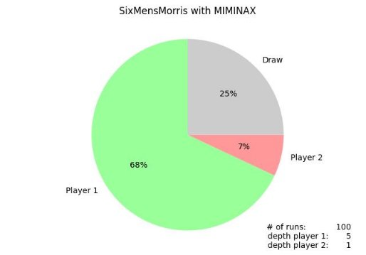
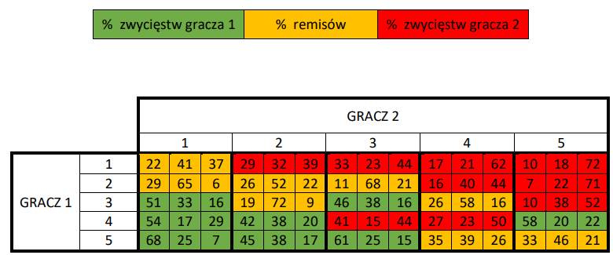

# Alpha-Beta Algorithm for Six Men's Morris Game

**[Polish version](README_PL.md)**

## 1. MINIMAX ALGORITHM WITH α-β PRUNING

The minimax algorithm is used to determine the value of the evaluation function for different game states, projecting ahead by *d* moves (depth). The algorithm operates recursively until reaching a depth of *d* or finding a terminal node (end of the game). Every other iteration prefers the maximum value of the evaluation function among available moves, alternating with the minimum value (simulating optimal opponent moves).

The version of the minimax algorithm with α-β pruning remembers the move with the best desired value (maximum/minimum) so far and avoids exploring moves that the opponent would not make optimally (if playing optimally) because they are unfavorable. This method allows for a significant speedup in the search. Table 1 presents simulation times for the minimax algorithm with and without α-β pruning:

**Table 1: Execution time of the minimax algorithm with and without α-β pruning.**

| Depth (for both players) | Minimax Time [s] | Minimax α-β Time [s] |
| ------------------------- | ----------------- | -------------------- |
| 1                         | 0.01              | 0.01                 |
| 2                         | 1.11              | 1.46                 |
| 3                         | 12.49             | 3.73                 |
| 4                         | 113.29            | 15.07                |
| 5                         | 1117.26 (approx. 19 minutes) | 37.09 |

As seen, α-β pruning significantly influences the speed, especially for greater depths. The α-β algorithm achieves a balance between computation accuracy and time cost.

## 2. IMPACT OF SEARCH DEPTH

Insufficient search depth may lead to the algorithm overlooking optimal moves and resulting in an unfavorable outcome. Conversely, excessive search depth can lead to excessively long computation times, significantly slowing down the algorithm.

Here's an example with a large difference in search depth between players (5 and 1), showing that greater depth statically increases the chances of winning:

**Table 2: Algorithm result statistics for different search depth combinations.**

Analyzing Table 2 reveals the minimal impact of the minimax algorithm on game outcomes. Usually, the player with a much greater search depth wins. However, individually, these results are not satisfactory. The heuristic function, which returns values for quasi-terminal nodes (reaching a specified depth), plays a crucial role. Currently, it only provides the difference in the number of pieces between players. To improve the evaluation function, consider adding extra points for strategic positions or having two pieces adjacent to each other (a mill possible in one move). This not only improves the program's effectiveness but may also accelerate its performance.

## 3. CONCLUSIONS

The implementation of the minimax algorithm for the "Six Men's Morris" game has been successfully completed. However, its effectiveness becomes noticeable only for significant differences in search depth. To enhance results, defining a more advanced heuristic function with a broader range of returned values than 0, 1, or 2 (as in the current case) is essential. Such a function may be easier to design for more complex games like chess, where specific pieces have assigned values.

This report demonstrated the significant impact of α-β pruning, reducing the time for 5 search depths from 19 minutes to only 30 seconds.

In summary, the deterministic algorithm's implementation was highly illustrative in this case. For real applications, value evaluation functions and move decisions should be much more advanced. The algorithm simulated 100 games for more accurate statistics, but this also increased the response time. One potential code improvement could be using a transposition table, speeding up calculations and avoiding repeatedly computing the same game states. This can be achieved by storing previously calculated heuristic values for a given game state in a dictionary and using them instead of recalculating.
