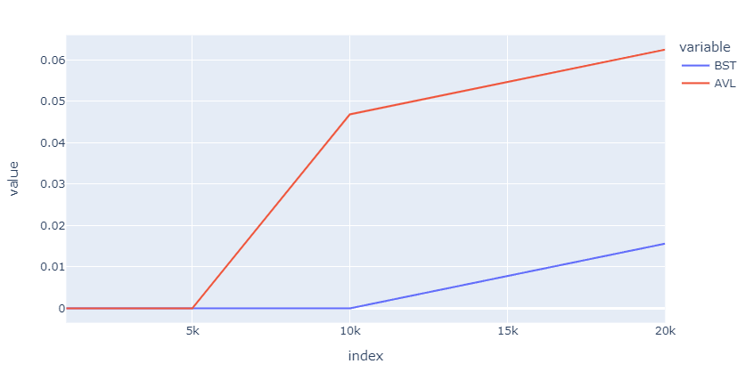
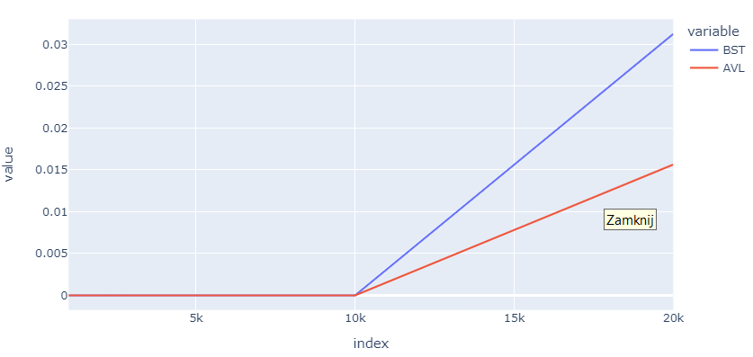
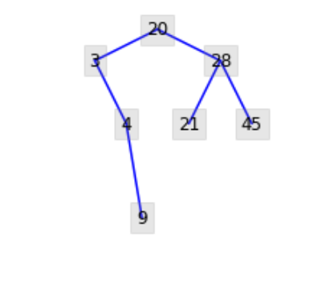
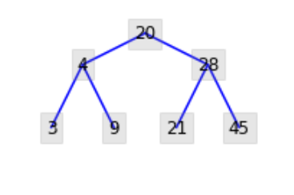

# **Comparison of BST and AVL Trees: Construction, Searching, and Deletion Time Analysis**

## Introduction

This report presents a detailed analysis comparing the time efficiency of constructing, searching, and deleting elements in Binary Search Trees (BST) and AVL Trees. The primary goal is to evaluate and contrast the performance of these two tree structures in various operations.

## Experimental Setup

The experiments were conducted using a comprehensive set of test cases, and the results are visualized in the provided Jupyter Notebook. The notebook includes detailed information on the construction time (Fig. 1), searching time (Fig. 2), and deletion time for BST (Fig. 3). Additionally, graphical representations of a BST (Fig. 4) and an AVL tree (Fig. 5) are provided for visual comparison.

## Results and Analysis

The comparison focuses on understanding how each tree structure performs in terms of time complexity for essential operations. The presented figures aim to illustrate the efficiency of tree construction, element searching, and deletion in both BST and AVL trees.

---

[See the results in the Notebook](report.ipynb)

*Fig. 1. Tree construction.*

*Fig. 2. Tree search.*

*Fig. 3. BST deleting element.*

*Fig. 4. BST tree.*

*Fig. 5. AVL tree.*
