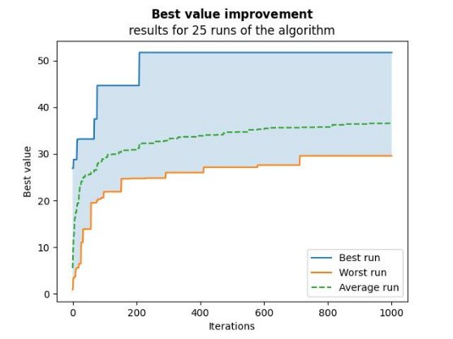

# **Genetic Algorithm for Drone Steering Optimization**

**[Polish version](README_PL.md)**

1. **GENETIC ALGORITHM AND FITNESS FUNCTION**

The goal of this task was to create a genetic algorithm based on a given fitness function. The function returns the maximum height reached by a 100-gene individual with the best combination of bits. It is worth noting that an individual with all bits set to 1 is undesirable due to increasing air resistance. Additionally, the function penalizes an individual that causes the drone to "crash" at a certain speed.

The genetic algorithm relies on the following hyperparameters:
- *individuals_number* - the number of individuals in the population (each having 100 genes)
- *iterations* - the number of algorithm iterations
- *pc* - crossover probability
- *pm* - mutation probability

Additional information about specific stages of the algorithm and the entire program is provided in code comments.

2. **RESULTS AND IMPACT OF HYPERPARAMETERS**

Initially, the following parameters were randomly set:
*pc* = 0.6, *pm* = 0.15
and relatively large values:
*individuals_number* = 400, *iterations* = 500
The algorithm was run 25 times (a commonly used number).

Fig. 1 shows that the fitness value increases with iterations—initially sharply, and later to a lesser extent—resembling a logarithmic function. This indicates that the genetic algorithm works well for multiple runs.

Sample results for initial iterations:

Usually, the first randomly selected individual has a value of about 1-3 units of the fitness function (meters). Figure 2 shows that the increase in value occurred only after 600 iterations, and further improvements occurred just before the 1000th repetition. Conversely, Figure 3 illustrates a scenario where improvement, i.e., finding a better value in subsequent iterations, was much more frequent.

There is also a chance, as shown in Figure 4, that the first individual immediately receives a high evaluation, "best initial = 26.92".

Parameters that certainly affect the algorithm's effectiveness when increased are:
- **number of individuals** - because a larger population increases the chance of finding "outstanding individuals"
- **number of iterations** - the increase in the best value is logarithmic, but there is a greater chance of randomly selecting a very good individual

Next, the impact of modifying the *pc* parameter—crossover probability—was examined. Due to the long simulation time (the previous section took about 4 minutes), the following values were reduced:
- individuals_number = 200
- iterations = 250
- algorithm runs = 5
for each *pc* value in {0.1, 0.25, 0.5, 0.75, 0.85}.

For the above data (Fig. 5) and the used objective function, the best *pc* value is 0.75. However, to achieve better certainty, the simulation should be run many more times (more than 5) and narrow down the optimization in the range of 0.5 - 0.85.

For the obtained crossover probability (considered the best), the fitness value optimization was performed again:

The graph in Figure 6 is very similar to that in Figure 2, and visually, the difference in values is negligible (numerically, an average of 1-2 meters more for 0.75). It should be noted that, despite everything, *pc* is a probability of crossover, so it is not possible to compare different runs of the algorithm "1 to 1." Averaged values favor *pc* = 0.75.

Figures 7 and 8 show results with doubled values: iterations = 1000, individuals_number = 800.

A higher number of iterations did not change much for this problem. As noted earlier, the value increases logarithmically, so after about 300 iterations, there are no significant changes. However, in initial runs, it is worth testing a larger number as the optimum may only be found after a long time (Fig. 2).

The calculations from Fig. 7 took: ***"Time taken: 2151.917777 seconds,"*** which is about 35 minutes on a computer with standard computing power.

Twice the number of individuals did not change the average value (about 35 meters), but because it provides a greater chance of randomly selecting an elite individual, running the algorithm with individuals_number = 800 returned the best value in all attempts throughout the task:

3. **CONCLUSIONS**

Increasing the values of parameters such as the number of individuals or the number of iterations statistically always brings better results, but at the cost of time.

It is essential to remember that a better approach is to search for solutions step by step, then narrow down the search in a specific "area" by increasing these hyperparameters for even greater accuracy.

Regarding crossover and mutation probabilities, there are no optimal values for them. They will differ depending on the fitness function. For the presented drone task, *pc* = 0.75 turned out to be the best result.

The impact of mutation probability was not tested. It is a random disturbance of a gene (bit change) and, in short, can be helpful in changing the search area and, in a favorable case, finding the global optimum (while the algorithm focused on a local optimum).

Finally, it is worth noting that we use optimization algorithms because we cannot test all possible X vectors—the number of all possible combinations of 100-bit vectors is enormous. For each bit of vector X, there are only two possible values (0 or 1), resulting in over 1 trillion possible combinations. Testing each of them is practically impossible, even for the fastest computers today. Therefore, optimization algorithms are used to efficiently search the solution space to find the best solution. If our problem had a much smaller number of possible combinations, we could check the fitness value for all of them and be sure of the best one.
