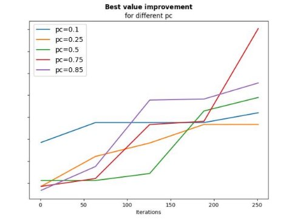
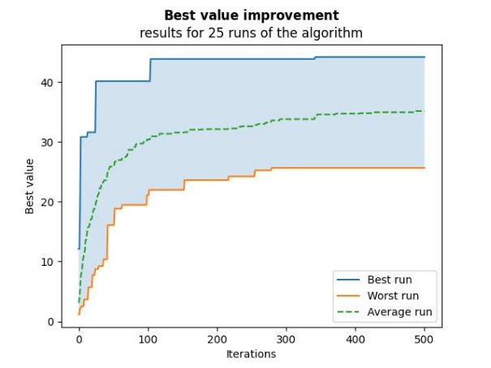

# **Genetic algorithm to otimization of drone steering**

1. **ALGORYTM GENETYCZNY ORAZ FUNKCJA OCENY** 

Celem zadania było stworzenie algorytmu genetycznego opartego o podaną funkcję oceny, która zwraca maksymalną wysokość drona, osiągniętą przez 100-genowego osobnika z najlepszą kombinacją bitów. Warto zauważyć, że osobnik z samymi bitami = 1 nie jest pożądany ze względu na narastające opory powietrza. Ponadto funkcja nakłada karę na osobnika, który spowoduje „rozbicie” drona przy określonej prędkości. 

Algorytm genetyczny bazuje na następujących hiper parametrach: 

- *individuals\_number* - liczba osobników w populacji (każdy mający 100 genów) 
- *iterations* - liczba iteracji algorytmu 
- *pc* - prawdopodobieństwo krzyżowania 
- *pm* - prawdopodobieństwo mutacji 

Informacje uzupełniające o konkretnych etapach działania algorytmu oraz całego programu są zawarte w komentarzach kodu. 

2. **REZULTATY ORAZ WPŁYW HIPERPARAMETRÓW** 

Początkowo ustawiono losowo następujące parametry: 

*pc* = 0.6, *pm* = 0.15 

oraz dość duże wartości: 

*individuals\_number* = 400, *iterations* = 500 

i uruchomiono algorytm 25 razy (powszechnie stosowana liczba). 

*Fig.  1. Średnia skuteczność działania algorytmu generycznego dla 25 uruchomień* 

Na  Fig.  1,  że  wartość  funkcji  oceny  rośnie  wraz  iteracjami  –  początkowo  gwałtownie,  a  później  w  niewielkim  stopniu  –  zatem  graf  przypomina  **funkcję  logarytmiczną**.  Pokazuje  to,  że  algorytm genetyczny działa właściwie dla wielu uruchomień. 

Przykładowe rezultaty dla początkowych iteracji: 

*Fig.  2. Rzadki „improvement”* 

*Fig.  3. Częsty „improvement”* 

*Fig.  4. Szybkie wylosowanie elitarnego osobnika* 

Zazwyczaj pierwszy wylosowany osobnik ma wartość około 1-3 jednostki funkcji oceny (metry). Fig. 2 pokazuje  że  zwiększanie  wartości  nastąpiło  dopiero  600  iteracji,  a  kolejne  tuż  przed  1000 powtórzeniem.  Natomiast  odwrotny  przypadek  znajduje  się  na  Fig.  3,  gdzie  „improvement”  czyli znalezienie lepszej wartości w kolejnych iteracjach było znacznie częstsze. 

Istnieje  też  szansa,  jak  na  Fig.  4,  że  pierwszy  osobnik  od  razu  otrzyma  wysoką  wartość  oceny,  „best initial = 26.92”. 

Parametrami, których podwyższenie na pewno wpływa na skuteczność algorytmu są: 

- **liczba  osobników**  –  ponieważ  im  większa  populacja,  tym  większa  szansa  na  znalezienie „wybitnych jednostek” 
- **liczba iteracji** – wzrost najlepszej wartości jest logarytmiczny, ale zwiększa się szansa, że zostanie wylosowany nowy bardzo dobry osobnik 

Następnie zbadano jaki wpływ ma modyfikacja parametru *pc* – prawdopodobieństwo krzyżowania. Wskazuje on jak często ma występować wymiana części chromosomów pomiędzy dwoma rodzicami  w celu stworzenia nowych osobników potomnych. 

Ze względu na długi czas symulacji (poprzedni podpunkt trwał około 4 minut), zostały zmniejszone: 

- liczba osobników = 200 
- iteracji = 250 
- uruchomień algorytmu = 5, 

odpowiednio dla każdej wartości *pc* = {0.1, 0.25, 0.5, 0.75, 0.85}. 

*Fig.  5. Skuteczność działania algorytmu generycznego dla różnych wartości pc* 

Dla powyższych danych (Fig. 5) oraz używanej funkcji celu, najlepsza wartość pc = 0.75. Natomiast dla uzyskania lepszej pewności powinno się uruchomić symulację dużo więcej razy (niż 5) oraz zawęzić optymalizację w zakresie 0.5 – 0.85. 

Dla  otrzymanego  prawdopodobieństwa  krzyżowania  (uznajmy  je  za  najlepsze)  przeprowadzono jeszcze raz optymalizację wartości oceny: 

*Fig.  6. Liczba osobników = 400, iteracje = 500, pc = 0.75* 

Wykres funkcji na Fig. 6 jest bardzo podobny do tego z Fig. 2, wizualnie różnica w wartościach jest niezauważalna (numerycznie to średnio 1-2 metry więcej dla 0.75). Należy pamiętać że mimo wszystko pc jest prawdopodobieństwem krzyżowania, także nie da się porównać różnych uruchomień algorytmu „1 do 1”, natomiast uśrednione wartości przemawiają na korzyść pc = 0.75. 

Na wykresach Fig. 7 i Fig. 8 zostały dwukrotnie zwiększone: liczba iteracji = 1000, 

` `liczba osobników = 800. 

Większa liczba iteracji w dla tego problemu nie zmieniła wiele. Jak już wcześniej zauważono, wartość rośnie  logarytmicznie,  a  zatem  po  ok.  300  iteracjach  nie  ma  już  wielkich  zmian.  Jednakże  przy początkowych uruchomieniach warto przetestować też większą ilość, ponieważ optimum może zostać odnalezione dopiero po długim czasie (Fig. 2). 

*Fig.  7. Liczba osobników = 400, iteracje = 1000, pc = 0.75* 

*Fig.  8. Liczba osobników = 800, iteracje = 500, pc = 0.75* 

Obliczenia z Fig.7 trwały: ***„Time taken: 2151.917777 seconds”**, c*zyli około 35 minut, komputerze ze standardową mocą obliczeniową.* 

Dwukrotnie większa liczba osobników nie zmieniła średniej wartości (ok. 35 metrów), jednak przez to że  daje  większe  szanse  na  wylosowanie  elitarnego  osobnika,  uruchomienie  algorytmu  z  liczbą osobników = 800 zwróciło najlepszą wartość podczas wszystkich prób w całym zadaniu: 

*Fig.  9. Najlepsza wartość funkcji oceny podczas całego zadania.* 

3. **WNIOSKI** 

Zwiększona wartość parametrów takich jak liczba osobników czy liczba iteracji statystycznie zawsze przyniesie lepsze rezultaty, jednakże kosztem czasu.  

Warto pamiętać, że lepszym podejściem jest poszukiwanie rozwiązań małymi krokami, a następnie zawężanie poszukiwań w określonym „obszarze” zwiększając powyższe hiper parametry dla jeszcze większej dokładności. 

Jeśli chodzi o prawdopodobieństwa krzyżowania i mutacji, to nie ma dla nich optymalnych wartości. Będą się one różnić w zależności od funkcji oceny. W przypadku przedstawionego zadania drona, najlepszym wynikiem okazał się pc = 0.75. 

Wpływ pradopobieństwa mutacji nie był testowany. Jest to losowe zaburzenie genu (zmiana bitu)  i w skrócie może być pomocne w zmianie obszaru poszukiwać i w korzystnym przypadku znalezienia optimum globalnego (podczas gdy algorytm skupiał się w optimum lokalnym). 

Na koniec warto dodać, że z algorytmów optymalizacji korzystamy, ponieważ nie jesteśmy w stanie przetestować  wszystkich  możliwych  wektorów  X  -  liczba  wszystkich  możliwych  kombinacji  100-bitowych wektorów jest bardzo duża. Dla każdego bitu wektora X są tylko dwie możliwe wartości  (0 lub 1), co daje ponad 1 trylion możliwych kombinacji. Przetestowanie każdej z nich jest w praktyce niemożliwe,  nawet  dla  najszybszych  obecnie  komputerów.  Dlatego  korzysta  się  z  algorytmów optymalizacji,  które  w  sposób  efektywny  przeszukują  przestrzeń  rozwiązań  w  celu  znalezienia najlepszego rozwiązania. Gdyby nasz problem miał dużo mniejszą liczbę możliwych kombinacji, można by sprawdzić wartość funkcji oceny dla nich wszystkich i być pewnym tego najlepszego. 
