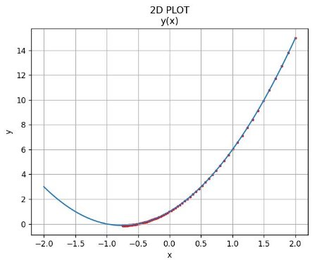
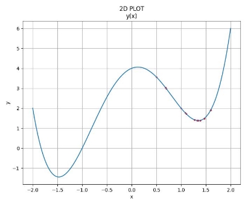
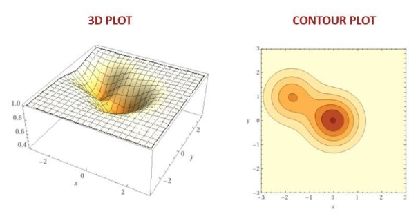
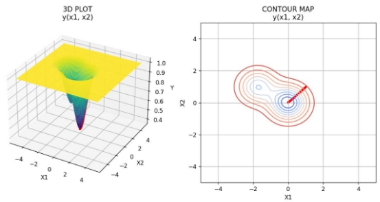
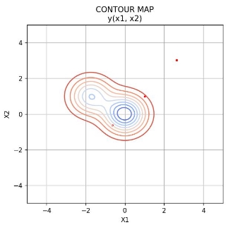
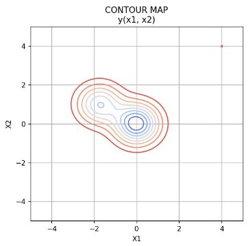
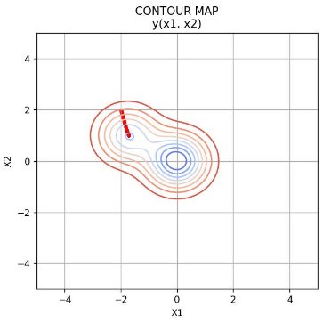

**WSTĘP DO SZTUCZNEJ INTELIGENCJI** 

LABORATORIUM 1 – RAPORT 

Student:  **Hubert Groen**   307866** Data:   **16.03.2023** 

**1.   OPIS ZADANIA** 

Zadanie wymaga stworzenia algorytmu do poszukiwania minimum globalnego następujących funkcji: Funkcja jednowymiarowa: 

( ) = + +** 

Funkcja dwuwymiarowa: 

( , ) = − . ∙ − − − . ∙ −( + . ) − ( − )

Gradienty powyższych funkcji zostały podane w instrukcji zadania oraz są zawarte w kodzie. Kluczowe parametry algorytmu zostały opisane w punktach 2 oraz 3, są to: 

- **learning\_rate** – współczynnik długości kroku, 
- **precision** – dokładność znalezionego rozwiązania (pomiędzy dwoma ostatnimi iteracjami), 
- **max\_steps** – limit iteracji. 
1. **FUNKCJA JEDNOWYMIAROWA f(x)** 

Analiza uruchomienia algorytmu dla przykładowej wartości początkowej (x = 2): 

*Fig.  1. Funkcja f(x) dla x=2.* 

Iteration 1: 2 

Iteration 2: 1.89 

Iteration 3: 1.7844 

(…) 

Iteration 169: -0.7471099866795737 Iteration 170: -0.7472255872123907 Iteration 173: -0.7475453771279417 

RESULTS SUMMARY FOR f(x): 

learning\_rate:   0.01 precision:   0.001 max\_steps:   10000 

x\_initial:     2 

x\_final:       -0.747643562042824 iterations:    173 

*Learning\_rate* określa jak szybko algorytm powinien poruszać się w kierunku minimum funkcji. Jeśli jest on bardo mały, może wydłużać czas obliczeń, a nawet podawać mniej dokładne rozwiązanie, dla przykładu: 

RESULTS SUMMARY FOR f(x): 

learning\_rate:   **0.001** precision:   0.001 max\_steps:   10000 

x\_initial:     2 

x\_final:    -0.72512311472929 iterations:    1174 

Mimo mniejszego learning rate wynik końcowy jest mniej dokładny. Natomiast w przypadku zbyt dużego  *learning\_rate*,  algorytm  w  kolejnych  krokach  może  „przeskakiwać”  minimum  lokalne  i prawdopodobnie nigdy do niego nie trafić: 

RESULTS SUMMARY FOR f(x): 

learning\_rate:   **0.5** precision:   0.001 max\_steps:   10000 

x\_initial:     2 x\_final:    2.0 iterations:    10000 

Rozważmy, przypadek innej funkcji jednowymiarowej, w której mamy dwa minima: 

2( ) = 4 ∙ 3 − 8 ∙ + 1 

*Fig.  2. Funkcja f2(x).* 

Wynik końcowy jest silnie uzależniony od punktu początkowego. Punkty większe od x = 0, mają małe szanse na znalezienie minimum globalnego. Musiałby zostać użyty czynnik losowy lub zwiększony *learning\_rate* (wraz z konsekwencjami opisanymi powyżej), ponieważ algorytm będzie najchętniej zbiegał w kierunku który wydaje się najbardziej obiecujący (matematycznie). Bardziej zaawansowane algorytmy  przeszukiwania  posiadają  dodatkowe  parametry  losowe,  sprawdzające  alternatywne „ścieżki”,  by  uniknąć  tzw.  „tunel-vision”  –  rozważanie  tylko  jednego  wariantu,  z  całkowitym pominięciem innych możliwości. 

Omówienie algorytmu jest kontynuowane w punkcie 2. Funkcja dwuwymiarowa. 

2. **FUNKCJA DWUWYMIAROWA g(x)** 

*Fig.  3. Źródło wykresów: wolframalpha.com* 

Analiza uruchomienia algorytmu dla przykładowych wartości **(x1 = 1, x2 = 1)**: 

*Fig.  4. Funkcja g(x) dla punktu początkowego (1,1).* 

Iteration 1: (0.9983645459581533, 0.9983759766011606) Iteration 2: (0.9967210560921321, 0.9967440018664104) Iteration 3: (0.9950694732051684, 0.9951040195353547) 

(…) 

Iteration 540: (-0.011180401331944471, 0.02053098715316187) Iteration 541: (-0.011305496913203547, 0.020430748805464097) Iteration 542: (-0.011429135203858663, 0.02033176213582331) 

RESULTS SUMMARY FOR g(x): 

learning\_rate:   0.01 precision:   0.001 max\_steps:   10000 

x\_initial:        (1, 1) 

x\_final:          (-0.011429135203858663, 0.02033176213582331) iterations:     542 

Algorytm  zakończył  się  po  542  iteracjach.  Znaczne  zwiększenie  *learning\_rate  =  1*  spowoduje pomnożenie gradientu przez większą wartość – „krok” do następnego punktu będzie większy, więc znajdziemy rozwiązanie w mniejszej licznie iteracji: 

RESULTS SUMMARY FOR g(x): 

learning\_rate:   1 precision:   0.001 max\_steps:   10000 

x\_initial:        (1, 1) 

x\_final:          (-0.02194210570455997, 0.012552612680346655) iterations:     9 

Jednakże  teraz  pojawia  się  ryzyko,  że mnożąc  przez  zbyt  dużą wartość  „przeskoczymy”  właściwe rozwiązanie i algorytm będzie zbieżny do niewłaściwego punktu. Np. dla *learning\_rate = 1:* 

*Fig.  5. Funkcja g(x) dla learning\_rate = 1.* 

Parametr *„precision”* porównujący różnicę pomiędzy dwoma ostatnimi punktami posiada podobne zalety  i  wady:  większa  wartość  dokładności  może  zmniejszyć  liczbę  iteracji,  ale  również  nie doprowadzić wystarczająco blisko do idealnego wyniku. 

Parametr *„max\_steps”* działa jako zabezpieczenie, by algorytm nie wykonywał bardzo dużej ilości kroków. Przekroczenie założonej wartości zawiadamia, że rezultat z wymaganą dokładnością nie został odnaleziony. 

Rozważmy inne przykładowe punkty początkowe dla funkcji g(x): **(x1 = 4, x2 = 4)** 

*Fig.  6. Funkcja g(x) dla dalekiego punktu początkowego.* 

RESULTS SUMMARY FOR g(x): 

learning\_rate:   0.01 precision:   0.001 max\_steps:   10000 

x\_initial:        (4, 4) 

x\_final:          (3.9999999999999996, 3.9999999999999996) iterations:     1 

Funkcja g(x) posiada 2 znaczące minima, jednak poza nimi na płaszczyźnie X1-X2 jest bardzo stała (identycznościowa), z tego względu kroki wykonane w funkcji z dala od extremum dadzą małe zmiany i warunek *„precision”* zostanie spełniony w 1 kroku. Można zwiększyć *„learning\_rate”*, jednak musimy się zmierzyć z tego konsekwencjami, opisanymi powyżej (przeskoczenie właściwego rozwiązania). 

Kolejnymi  ciekawymi  wartościami  początkowymi,  będą  punkty  w  okolicy  minimum  lokalnego, np. **(x1 = -2, x2 = 2)**. 

*Fig.  7. Problem minimum lokalnego w funkcji g(x).* 

RESULTS SUMMARY FOR g(x): 

learning\_rate:   0.01 precision:   0.001 max\_steps:   10000 

x\_initial:        (-2, 2) 

x\_final:          (-1.7109787562145413, 0.9918727284019442) iterations:     590 

Mimo wykonania dużej liczby iteracji, algorytm podał wartość minimum lokalnego, ze względu na malejącą precyzję kroku pomiędzy kolejnymi punktami w jego okolicy. 

Wnioski oraz proponowane rozwiązanie wymienionych problemów zostało opisane w 3. Wnioski. 

Warto dodać, że w opisywanym algorytmie zmiany kroków dla x1 i x2 są dokonywane równolegle  (w jednej pętli). W przypadku funkcji do minimum której spadek jest mniej więcej taki sam z każdej ze stron, nie stanowi to problemu. Jednak to rozwiązanie nie miałoby zastosowania przy trudniejszych funkcjach do testowania algorytmów optymalizacji, np. funkcji bananowej Rosenbrocka, która posiada wąskie paska minimów lokalnych. 

*Fig.  8. Źródło wykresu: A. Eilmes, Metody numeryczne w chemii.* 

To znaczy, że idąc od punktu (x = 1.5, y = 2.5) algorytm najpierw powinien modyfikować bardziej wartości  y,  pozostając  w  wąskim  zakresie  *0.5  <  x  <1.5*.  Natomiast  przybliżając  się  do  minimum globalnego, pozostawić wartości y granicach *0 < y < 0.5*, a wykonywać większe kroki dla x. 

**3.  WNIOSKI** 

Nie  ma  jednoznacznego  rozwiązania  powyższych  problemów  z  doborem  parametrów.  Jak  widać zmienianie ich wartości (*learning\_rate, precision, max\_steps*) to nadal losowe próby, które mają niskie szanse powodzenia. Dużo bardziej optymalnym rozwiązaniem będzie uruchomienie algorytmu dla kilku różnych punktów początkowych i statystyczne wyłonienie najlepszego (np. średnia, mediana). Większość  algorytmów  przeszukiwania  działa  trybie  losowym,  jednak  zdarza  się,  że  przed optymalizacją  posiadamy  tzw.  „wiedzę  ekspercką”.  Należy  wtedy  ukierunkować  badania  na sugerowany obszar. 

Niezależnie od metody początkowej, po znalezieniu najlepszego punktu można dodatkowo zawęzić poszukiwania w jego okolicy znacząco zmniejszając *„learning\_rate”* oraz *„precision”*, w zależności jak bardzo dokładne rozwiązanie nas interesuje (zazwyczaj różnice w okolicach 0.1 – 0.001 są uznawane optymalne). 
