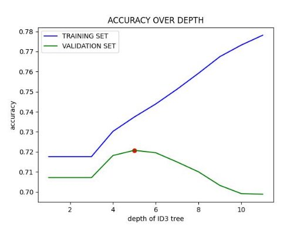
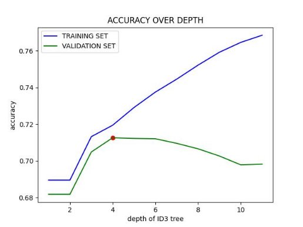

# **ID3 Algorithm on Cardiovascular Disease Dataset**

**[Polish version](README_PL.md)**

## 1. ID3 ALGORITHM

The ID3 algorithm builds a classification tree in such a way that labels that best separate the data (have the highest entropy) are placed in nodes closest to the root. This allows for correct classification of new data by traversing the tree nodes to determine the final result. In this case, medical "questions" are placed in the nodes, and based on them, one can reach a leaf with the "answer" whether a given patient may suffer from heart disease.

The input dataset consists of around 70 thousand records. It was randomly divided into a training, validation, and test set (60-20-20%). Additionally, parameters with a large range of values were discretized.

Next, the attribute with the highest entropy (most effective in separating classes) is chosen from the available attributes. A decision node with this attribute is created in the tree, and ID3 is called recursively for its subset.

The resulting tree is evaluated for accuracy in predicting labels of new data. In short, the function "traverses" the decision tree based on sample data. In the end, the list of predictions is compared with the true values from the "cardio" class.

## 2. IMPACT OF CLASSIFICATION TREE DEPTH ON PREDICTION ACCURACY

Excessive depth of the ID3 tree does indeed group the training set data very accurately, but for new data, the classifier will not be as accurate (even very poor). This phenomenon is called overfitting. Therefore, in this subpoint, the validation set is used to check the prediction accuracy of the classifier on new data at all possible depths (as many as there are labels in the set). This is illustrated in Fig.1:

From a certain depth (here 5), the prediction accuracy for new data significantly decreases. This example shows that in the ID3 algorithm, an appropriate depth of the classification tree must be selected to ensure optimal generalization and prevent underfitting or overfitting.

For the "best depth," predictions were made for the test set (20% of all data).

As seen in Fig.2, a result of 70% accuracy is a good outcome, confirming avoidance of overfitting the classifier.

## 3. CONCLUSIONS AND IMPLEMENTATION NOTES

The implementation of the ID3 classifier can be considered correct since it works with approximately 70% precision for the test dataset.

However, it's worth noting that the initial discretization of data plays a significant role here. Some input attributes (e.g., height, cholesterol) have a large range of values, so certain threshold values need to be established to divide them into unique classes. This is done partly proportionally (every 20%) and selectively (potential poor division from a medical point of view). Applying a different division has a significant impact on the structure of the ID3 tree and, consequently, on subsequent predictions.

As shown in Fig.3, in the case of slightly modified discretization, the most optimal depth is 4.

The ID3 algorithm itself is not the best classification algorithm, firstly because it tends to create decision trees of too high complexity, which can perfectly fit training data but do not perform well on new test data. Secondly, when limiting the depth, ID3 does not handle missing attribute values well. In the case of missing values, the algorithm removes the decision node and interrupts tree construction. Additionally, it does not support continuous attributes. Therefore, more advanced algorithms based on it exist, e.g., C4.5. Regarding the issue of missing values, various imputation strategies exist.
