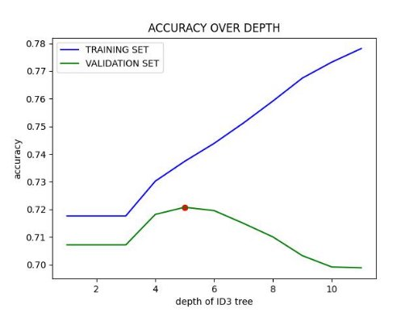
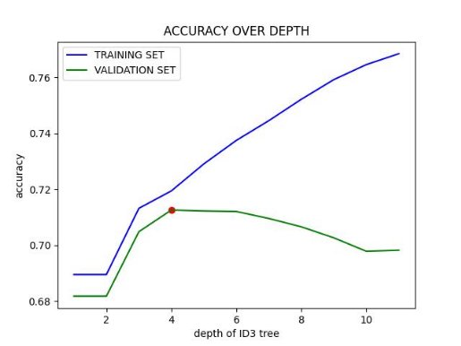


# **ID3 algoritm on Cardiovascular Disease dataset**

1. **ALGORYTM ID3** 

Algorytm ID3 buduje drzewo klasyfikacji w taki sposób, żeby w węzłach najbliżej korzenia znajdywały się etykiety, które najlepiej rozdzielają dane (mają największą entropię). Pozwala to na prawidłowe klasyfikowanie nowych danych, by na podstawie przejścia przez kolejne węzły wyznaczyć rezultat końcowy. W tym przypadku w węzłach znajdują się „pytania” medyczne, a na ich podstawie można dojść do liścia z „odpowiedzią” czy dany pacjent może cierpieć na choroby serca. 

Zbiór wejściowy składa się z około 70 tysięcy danych. Został on losowo podzielony na zbiór treningowy, walidacyjny i testowy (odpowiednio 60-20-20 %). Dodatkowo parametry o dużym zakresie wartości zostały poddane dyskretyzacji. 

Następnie z dostępnych atrybutów wybierany jest ten o najwyższej entropii (najbardziej skuteczny  w separowaniu klas), w drzewie tworzony jest węzeł decyzyjny z tym atrybutem, a ID3 wywołane rekurencyjnie dla jego podzbioru. 

Gotowe drzewo jest poddawane ocenie dokładności w przywidywaniu etykiet klas nowych danych.  W skrócie, funkcja „przechodzi” przez drzewo decyzyjne na podstawie danych z próbki. Na koniec lista predykcji jest porównana z prawdziwymi wartościami z klasy „cardio”. 

2. **WPŁYW GŁĘBOKOŚCI DRZEWA KLASYFIKACJI NA DOKŁADNOŚĆ PREDYKCJI** 

Zbyt duża głębokość drzewa ID3 owszem rozgrupuje dane ze zbioru uczącego w bardzo dokładny sposób, jednak dla nowych danych klasyfikator nie będzie już taki dokładny (a nawet bardzo zły). Takie zjawisko nazywamy przeuczeniem. Dlatego w tym podpunkcie wykorzystano zbiór walidacyjny by sprawdzać  dokładność  predykcji  klasyfikatora  na  nowych  danych,  na  wszystkich  możliwych głębokościach (jest ich tyle co etykiet w zbiorze). Jest to zobrazowane na Fig.1: 

*Fig.  1. Dokładność predykcji a głębokość drzewa ID3.* 

Od pewnej głębokości (tutaj 5), dokładność predykcji na nowych danych znacząco spada. Ten przykład pokazuje,  że  w  algorytmie  ID3  trzeba  dobrać  odpowiednią  głębokość  drzewa  klasyfikującego,  by zapewnić optymalną generalizację, a zapobiec niedotrenowaniu lub przeuczeniu. 

Dla „najlepszej głębokości” uruchomiono predykcję dla zbioru testowego (20% wszystkich danych). 

*Fig.  2. Dokładność predykcji dla zbioru testującego.* 

Jak  widać  na  Fig.2,  rezultat  70%  dokładności  jest  dobrym  wynikiem.  Potwierdza  do  uniknięcie przeuczenia klasyfikatora. 

3. **WNIOSKI ORAZ UWAGI DO IMPLEMENTACJI** 

Implementację klasyfikatora ID3 można uznać za poprawną, ponieważ dla testowego zbioru danych działa z precyzją około 70%. 

Warto  jednak  zauważyć,  że  dużą  rolę  odgrywa  tutaj  początkowa  dyskretyzacja  danych.  Niektóre atrybuty wejściowe (np. wzrost, cholesterol) mają duży zakres wartości, dlatego trzeba ustalić pewne wartości progowe i podzielić je na unikalne klasy. Jest to zrobione po części procentowo (co 20%)  i wybiórczo (możliwy zły podział z medycznego punktu widzenia). Zastosowanie innego podziału ma znaczący wpływ na strukturę drzewa ID3, a więc późniejszych przewidywań. 

*Fig.  3. Dokładność predykcji vs głębokość dla innej dyskretyzacji.* 

Jak pokazuje Fig.3, w przypadku nieco zmienionej dyskretyzacji, najbardziej optymalna głębokość wynosi 4. 

Sam algorytm ID3 nie jest również najlepszym algorytmem klasyfikacji, ponieważ po pierwsze ma tendencję do tworzenia drzew decyzyjnych o zbyt dużym stopniu skomplikowania, które są w stanie idealnie  dopasować  się  do  danych  treningowych,  ale  nie  radzą  sobie  dobrze  z  nowymi  danymi testowymi.  Natomiast  przy  zastosowaniu  ograniczenia  głębokości,  ID3  nie  radzi  sobie  dobrze  z brakującymi wartościami atrybutów. W przypadku brakujących wartości, algorytm  usuwa węzeł decyzyjny i przerywa konstrukcję drzewa. Dodatkowo nie ma możliwości zastosowania atrybutów ciągłych. Dlatego istnieją bardziej zaawansowane algorytmy na jego podstawie, np. C4.5. A jeśli chodzi np. o problem brakujących wartości, istnieją różne strategie uśredniające. 
