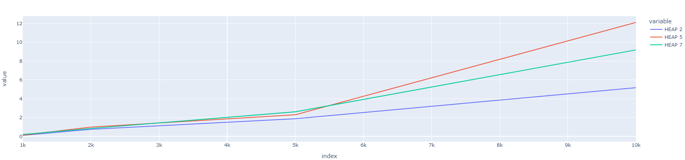
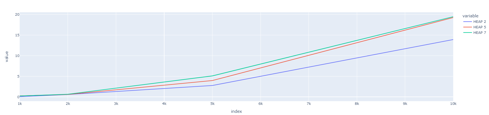
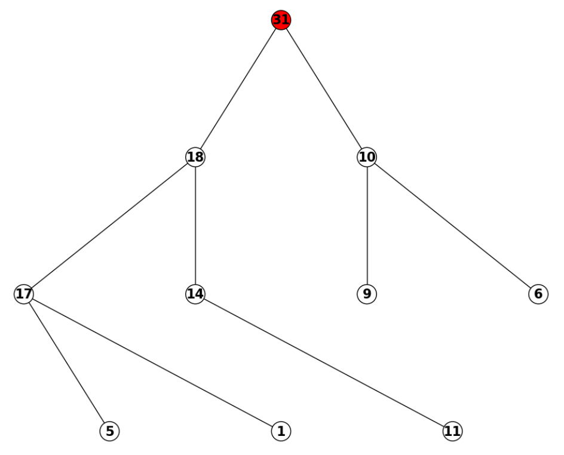
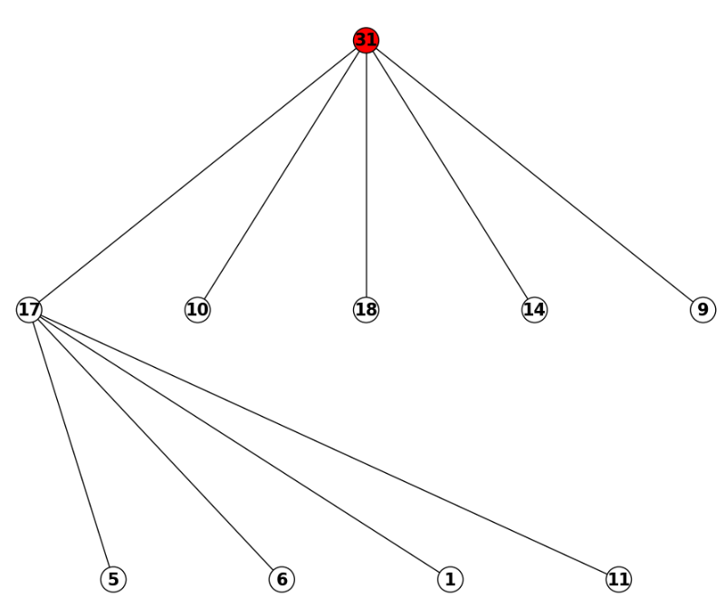
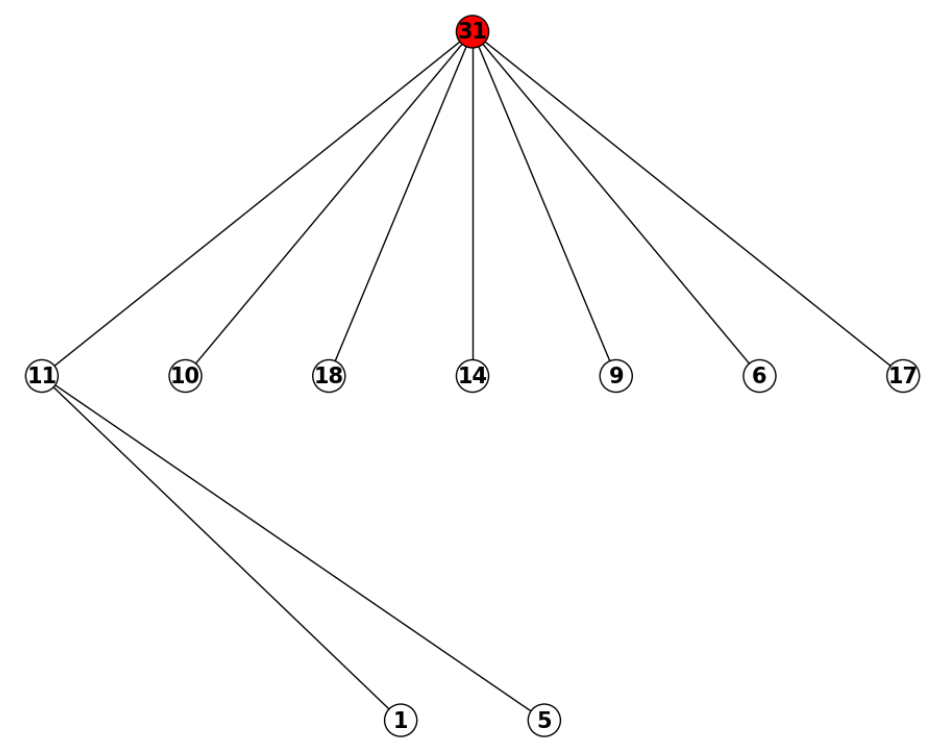

# **Analysis of K-ary Heaps + visualisation**

[See the results in the Notebook](report.ipynb)

*Fig.  1. Creation of K-ary heaps.* 

*Fig.  2. Deleting the root in K-ary heaps.* 

*Fig.  3. 2-ary heap.* 

*Fig.  4. 5-ary heap.* 

*Fig.  5. 7-ary heap.* 
