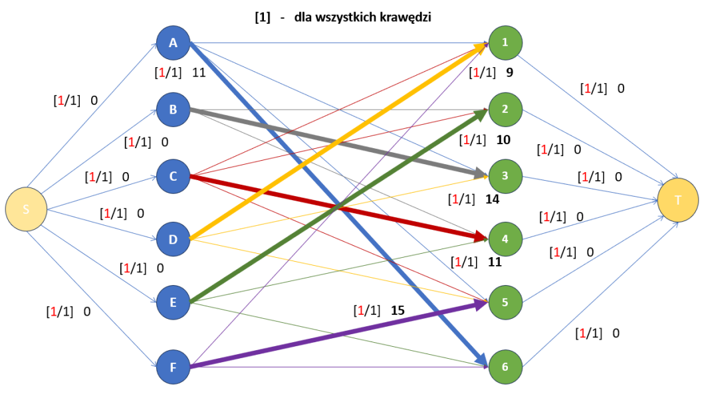
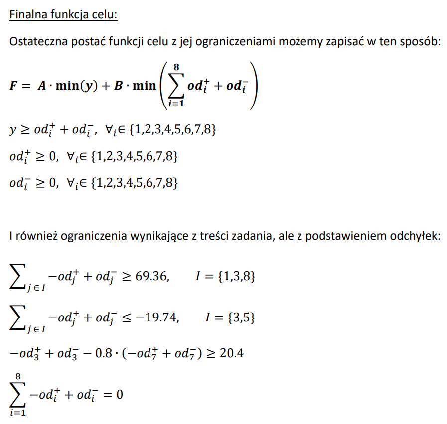

# **Programowanie liniowe**

Projekt miał na calu rozwiązanie trzech zadań z zakresu modelowania matematycznego. Pełna treść zadań znajduje się [tutaj](task.pdf), natomiast formalny opis matematyczny oraz rozwiązania w [raporcie](report.pdf).

1. **SIEĆ PRZEPŁYWOWA** 

Zadaniem było sformułowanie modelu sieciowego i rozwiązanie problemu najtańśzego przepływu przy spełnieniu wymaganych ograniczeń.

*Fig.  1. Sieć przepływowa z przepustowościami i kosztami.* 

2. **ZADANIE PRZYDZIAŁU** 

Zadanie polegało na przydzieleniu zespołów do projektów minimalizując sumaryczny koszt - zadanie najtańszego skojarzenia.

*Fig.  2. ROZWIĄZANIE: przydział zespołów do projektów.*

3. **ZADANIE MODELOWANIA ODCHYŁEK** 

Celem tej części była minimalizacja odchyłek cen produktów od wartości bazowych, przy spełnieniu założonych wymagań.

Sformułowanie zadania programowania liniowego wymagało rozwiązanie problemu wartości bezwzględnej oraz MinMax.

*Fig.  3. Zapis zadania programowania liniowego: funkcja celu + ograniczenia.*

