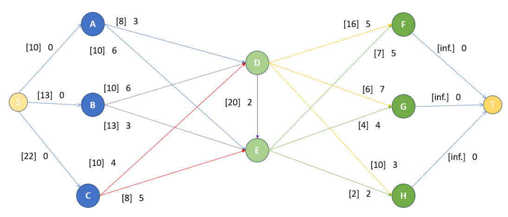

# **Linear Programming project"**

Tasks description can be found in 'task.pdf', formulation of linear programming problems and solutions in 'report.pdf'.

Folder 'algorithms' contains scripts of LP to check the corectness of proposed solutions.

<!-- 

*Fig.  1. Cost and accuracy of the training set over iterations.*  -->

