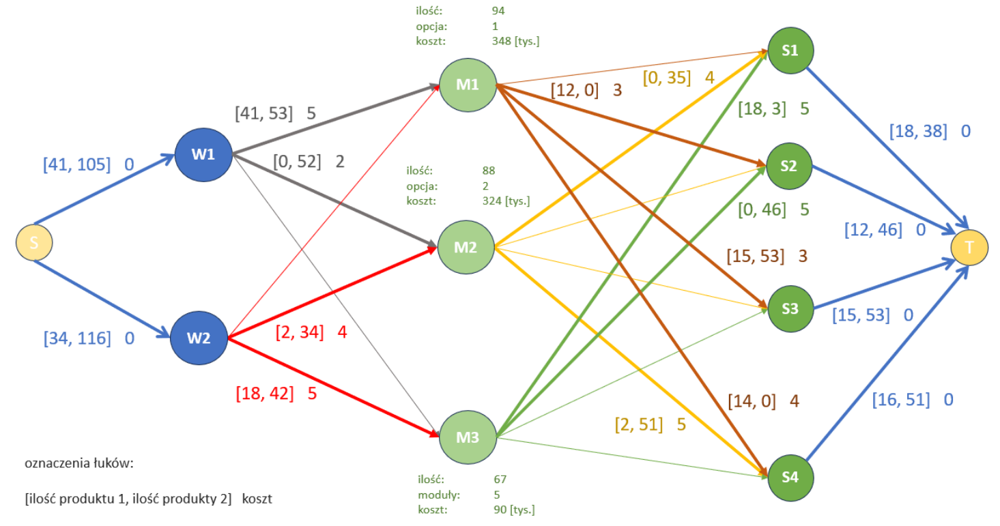

# **Programowanie liniowe - projekt 2**

Projekt miał na celu sformułowanie modelu programowania mieszanego liniowego-całkowitoliczbowego w sieci wielotowarowej przy zadanych ograniczeniach.
Pełna treść polecenia znajduje się [tutaj](task.pdf), zapis matematyczny modelu z objaśnieniami zawarty jest w [raporcie](report.pdf).

Model został zaimplementowany w AMP ([model](model.mod) oraz [parametry](parameters.dat)), a poniżej znajduje się graficzna reprezentacja optymalnego rozwiązania:

*Fig.  1. Szkic znalezionego rozwiązania przy pomocy AMPL.* 