# Neural Network on MNIST dataset

**[Polish version](README_PL.md)**

## 1. INTRODUCTION

The aim of the fifth WSI laboratory task was to implement a neural network class that recognizes digits in an image. Data were obtained from the "sklearn" dataset and organized as in previous exercises (divided into X and Y, and into training, validation, and test sets).

The solution consists of two essential classes:
A) **class Layer** – representing a single layer of the neural network
B) **class Network** – representing the neural network
("hidden_count" - the number of hidden layers, "hidden_size" - the size of hidden layers, and "learning_rate" – the learning rate)

In summary, the "forward_propagation" method performs forward signal propagation through the neural network (activation of neuron weights). The "backward_propagation" method implements the backpropagation algorithm, allowing the updating of network weights. The backpropagation process starts by calculating the error between the network predictions and the expected output values. Then the error is backpropagated through the network layers to calculate weight gradients.

## 2. NETWORK TRAINING

A "safe" range for the number of epochs, in my case, is around 200. Higher values can further increase prediction accuracy, but overfitting often occurred in such cases, as shown in Fig. 2. Training uses "batches" instead of individual data points, helping to reduce noise that may occur at the level of individual examples.

Note: the algorithm could be improved so that when accuracy starts to decrease in the i-th epoch, it should stop further iterations.

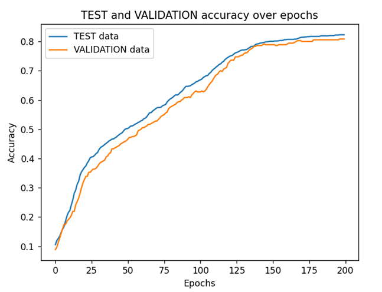

**Fig. 1.** Prediction accuracy for 200 epochs.

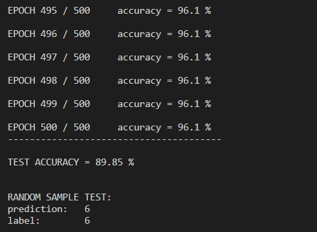

**Fig. 2.** Example of overfitting with a large number of epochs.

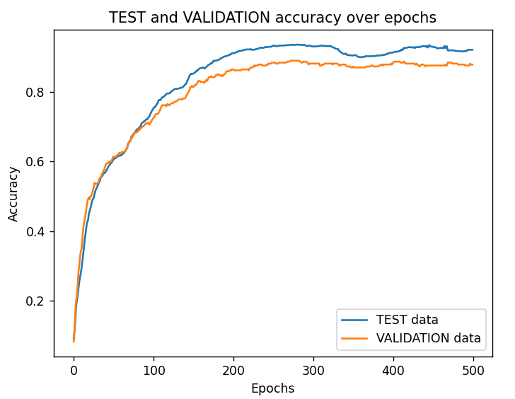

**Fig. 3.** Sample run for 500 epochs without overfitting.

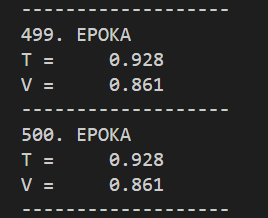

**Fig. 4.** Final epochs iterations.

A higher learning rate can significantly speed up increasing accuracy in the initial epochs (larger jumps), but it increases the possibility of divergence from the optimum.

**Fig. 5.** Increased learning rate.

## 3. CONCLUSIONS AND IMPLEMENTATION NOTES

The neural network and predictions work correctly with an accuracy of approximately 80-90%. Higher accuracies are possible but may lead to overfitting with too large input parameters. Occasionally, errors occurred during execution, and the maximum accuracy was 50-60%. It is recommended to increase the network size, but this would be associated with a much longer computational time.

In the end, randomly selected test samples are recognized correctly - examples:

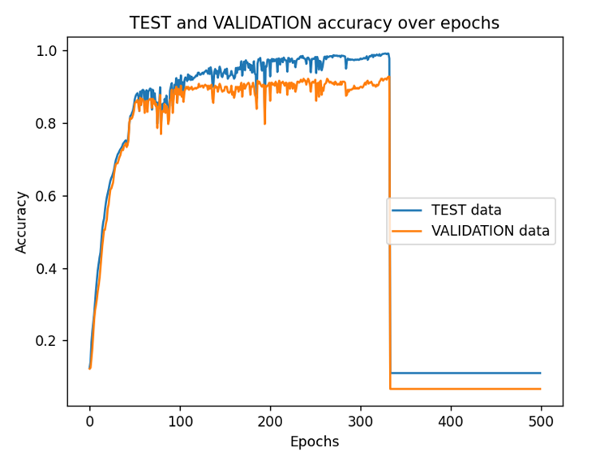
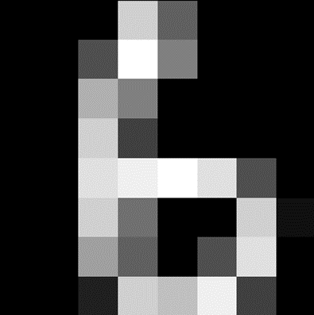
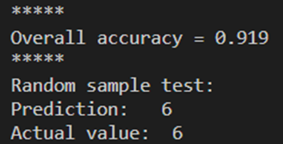
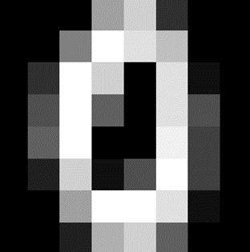
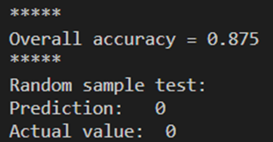
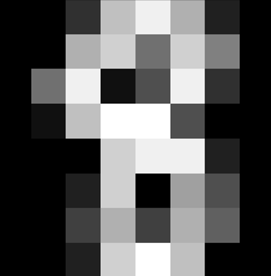
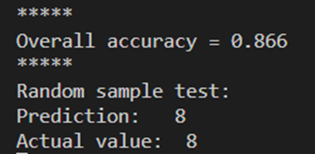
