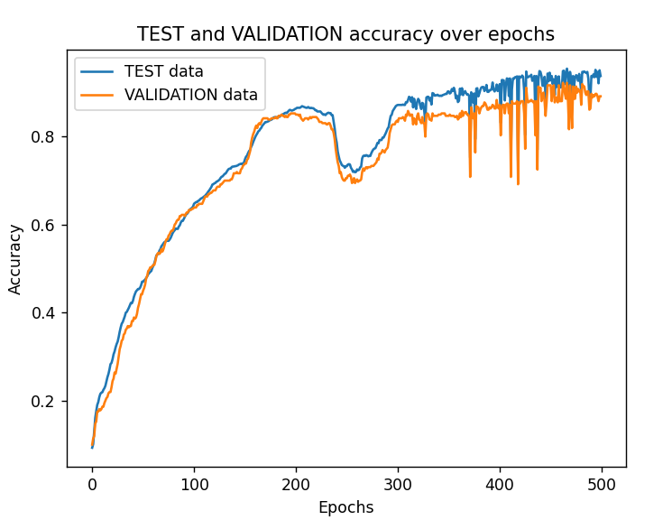
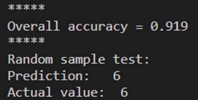

# Sieć neuronowa na zbiorze danych MNIST

**[English version](README.md)**

## 1. WPROWADZENIE

Celem piątego zadania laboratorium WSI było zaimplementowanie klasy sieci neuronowej, która rozpoznaje cyfrę na obrazku. Dane zostały pobrane ze zbioru "sklearn" i zorganizowane tak jak w poprzednich ćwiczeniach (podział na X i Y, oraz na zbiory: treningowy, walidacyjny, testowy).

Rozwiązanie składa się z dwóch istotnych klas:
A) **class Layer** – reprezentuje pojedynczą warstwę sieci neuronowej
B) **class Network** – reprezentuje sieć neuronową
("hidden_count" - liczba warstw ukrytych, "hidden_size" - rozmiar warstw ukrytych oraz "learning_rate" – współczynnik nauki)

W skrócie, metoda "forward_propagation" przeprowadza propagację sygnału w przód przez sieć neuronową (aktywacja wag neuronów). Metoda "backward_propagation" implementuje algorytm propagacji wstecznej, który umożliwia aktualizację wag sieci. Proces propagacji wstecznej rozpoczyna się od obliczenia błędu między predykcjami sieci a oczekiwanymi wartościami wyjściowymi. Następnie błąd jest propagowany wstecz przez warstwy sieci, aby obliczyć gradienty wag.

## 2. TRENOWANIE SIECI

"Bezpieczny" zakres ilości epok to w moim przypadku około 200. Wyższe wartości mogą jeszcze bardziej zwiększyć dokładność predykcji, jednak przy uruchomieniach często występowało przeuczenie, taki problem widać na Fig.2. Trenowanie używa "paczek" zamiast pojedynczych danych, co pomaga w zmniejszeniu szumów, które mogą występować na poziomie pojedynczych przykładów.

Uwaga: algorytm mógłby być ulepszony w taki sposób, że gdy w i-tej epoce dokładność zaczyna maleć, powinien przerwać dalsze iteracje epok.

**Fig. 1.** Dokładność predykcji dla 200 epok.

**Fig. 2.** Przykład overfitting'u przy dużej liczbie epok.

**Fig. 3.** Przykładowe uruchomienie dla 500 epok, bez przeuczenia.

**Fig. 4.** Końcowe iteracje epok.

Wyższy współczynnik nauki ("learning rate") może znacznie przyśpieszyć zwiększenie dokładność w pierwszych epokach (większe skoki), jednak zwiększa możliwość rozbieżności od optimum.

**Fig. 5.** Zwiększony "learning rate".

## 3. WNIOSKI ORAZ UWAGI DO IMPLEMENTACJI

Sieć neuronowa oraz predykcje działają poprawnie ze skutecznością ok. 80-90%. Wyższe dokładności są możliwe, ale mogą powodować przeuczenie przy zbyt dużych parametrach wejściowych. Od czasu do czasu, przy uruchomieniu pojawiały się błędy i maksymalna dokładność wynosiła 50-60%. Zalecane jest by zwiększyć rozmiar sieci, jednak wiązałoby się to ze znacznie dłuższym czasem obliczeniowym.

Ostatecznie, losowo wybrane próbki testowe są rozpoznawane prawidłowo - przykłady:

