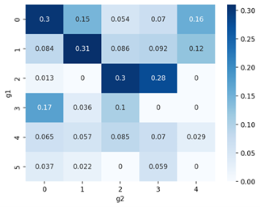

# SOCIAL NETWORK ANALYSIS TECHNIQUES

**[Polish version](README_PL.md)**

## Team

This project was a collaborative work of:

- [Wojciech Gierulski](https://github.com/WojciechGierulski)
- [Mariusz Zembron](https://github.com/mzembron)
- [Hubert Groen](https://github.com/hubert-groen)

## Project Topic

Comparison of network features between state-node networks in financial or commodity flow networks and analogous features in networks of international organizations or bilateral trade agreements.

## 1. CONCEPT

### Financial Flow Network

The first dataset was obtained from the OECD (Organization for Economic Cooperation and Development) website, which provides a wide range of information on financial flows between countries in various categories, including balance of payments, international costs of transport, and insurance in the trade of goods.

For our project, we selected data on international trade in services. They are organized in the form of a table [member state, state], where values represent the balance of payments in trade in services. Formally, this indicator is called EBOPS (Extended Balance of Payments Services Classification) and is commonly used in economic statistics. The values are expressed in millions of USD.

It is worth noting that the data include not only member states but all countries with which they cooperate.

The dataset does not cover all possible financial flows, such as industry or goods exports, but a significant part of them (services), providing valuable information about cooperation between individual countries. Considering the second dataset on international organizations will allow for an interesting comparison to see if common membership in organizations aligns in any way with financial flows.

The connection network created based on this data will have the following structure:
- Nodes represent individual countries.
- Edges represent mutual financial transfers (not present between all countries, as it depends).
- Edge weight corresponds to the number of transferred funds (values will be appropriately normalized).

*Fig. 1. Example rows from the OECD dataset.*

### International Organizations Network

IGO datasets contain information about international organizations whose members include at least 3 countries, from 1815 to 2014. IGO data is collected in 5-year intervals from 1815 to 1965, and then annually.

The dataset can be downloaded as a single .csv file from the Correlates of War website. The data is available in tabular form. The table rows contain a list of international organizations, and the columns list of countries. Binary values 0/1 indicate non-membership/membership.

*Fig. 2. Example rows from the IGO dataset.*

Such a dataset shows how strongly states are connected in terms of belonging to the same organizations, which may or may not align with the amount of financial flows.

The data comes from the Correlates of War organization (study of war actions). Despite the departure from economic themes, the organization provides data on membership in international organizations, which can also be used in the context of our analysis.

The connection network created based on this data will have the following structure:
- Nodes represent individual countries.
- Nodes are connected if they belong to the same organization.
- Edge weight corresponds to the number of common organizations for a given pair of countries.

## 2. DATA PREPARATION
After downloading the data, they required preparation for further analysis. All the steps can be checked in the [file](/DATA/dataset_processing.ipynb), which transforms the original .csv files into files ready for further steps through the following operations:

After downloading the data, it was necessary to prepare them for further analysis. All the steps of this process can be analyzed in the "dataset_processing.ipynb" file. Below are the main stages of data transformations:

1. **Column Filtering:**
   In the financial flows dataset, only necessary columns were retained: country X country Y sum of flows.

2. **Flow Reduction:**
   To simplify the analysis, a decision was made to reduce flows. For example, if Austria sent $200 million to Belgium, and at the same time, Belgium sent $100 million to Austria, only one "Austria-Belgium" connection with a value of $300 million was kept.

3. **Standardization of Country Names:**
   To ensure consistency of nodes in both networks, a process of standardizing country names was carried out. For example, "United States" was changed to "usa," and "SKorea" to "southkorea."

4. **Removal of Countries Occurring Only in One Dataset:**
   Countries that appeared only in one of the datasets were eliminated. For example, the dataset of organization membership included many countries that no longer exist, such as Yugoslavia, USSR, West/East Germany.

5. **Transformation of Organization Dataset:**
   Data on organization membership were transformed from a binary form (membership fact) into a relation: country X country Y number of common organizations. This allows the creation of weighted edges with the value of the third column between individual countries (nodes) - columns 1 and 2.

 

Financial flow data before preparation: [FINANCES_original](/DATA/FINANCES_original.csv)

Financial flow data after preparation: [FINANCES_dataset](/DATA/FINANCES_dataset.csv)

Organization data before preparation: [ORGANIZATIONS_original](/DATA/ORGANIZATIONS_original.csv)

Organization data after preparation: [ORGANIZATIONS_dataset](/DATA/ORGANIZATIONS_dataset.csv)

## 3. ANALYSIS

The functions used for the analysis are available in the [file](/DATA/clustering.ipynb).

### 3.1 AGGLOMERATIVE CLUSTERING

In the organization dataset, countries in the same clusters mainly belong to the same continents, especially in the central parts of the clusters. At the edges of the clusters, there may be node-countries from other continents, but they are so small (with very few flows) that it can be considered noise (they must have been attached somewhere).

An example is Somalia, which has been attached to the Middle East cluster, even though it is geographically very close (only the Gulf of Aden separates it from Yemen). In the context of drawing the graph, Somalia is located in the upper right corner of the cluster, somewhat "attracted" by the African cluster further in that direction.

It is worth noting that clusters labeled with different colors tend to gather countries from specific geographical regions, facilitating geographical identification. For example, the gray cluster focuses on Middle Eastern countries, the red one mainly includes European countries, the green one represents African countries, and the brown one represents South American countries. The orange cluster is a mixture of countries from North America, Asia, and Oceania.

The network of organizations is a complete graph because each country belongs to at least one common organization with any other country. Most collaborations are local organizations, starting from well-known ones like the European Union, African Union, Mercosur (South America), to smaller ones like the Nordic Council, Benelux, COPPPAL (Latin America).

*Fig. 3. International organizations network with clustering.*

In the financial flows dataset, geographical connections are also visible but are sometimes "dominated" by the scale of financial values, resulting in giants landing next to each other, even if they are not on the same continent.

A good example is the purple cluster, bringing together the USA, China, Japan, Canada, Israel, North Korea, and Australia. These connections are due to the level of economic development of countries. To this cluster are also attached Mexico, Indonesia, Thailand, India, and Malaysia - countries geographically linked to the aforementioned giants.

In the yellow cluster, countries from Central and Eastern Europe can be observed: Poland, Germany, Austria, Slovakia, Slovenia, Ukraine, Belarus. Countries on the edges of the cluster (Laos, Sierra Leone) can be considered noise or single large collaborations between those particular countries.

In the remaining clusters, the overall geographical division is not as noticeable, but often neighboring country nodes are close to each other: Portugal, France, Italy, Norway, Russia, Lithuania, Estonia, Finland.

*Fig. 4. Financial flows network with clustering.*

The Jaccard similarity between clusters from the financial flows network (g1) and the international organizations network (g2) is presented in the matrix below. Clusters 0,1,2, and 3 from g2 have their similar counterparts in the cluster groups from g1. Cluster 4 from g2 is similar to two clusters from g1. The table also shows selected countries common between the most similar clusters from g1 and g2. Clusters 4 and 5 from g1 do not have a similar counterpart in g2.

*Fig. 5. Similarity matrix between clusters from different networks.*

- Similarity of clusters 0-0: mainly European countries
- Similarity of clusters 1-1: mainly African countries
- Similarity of clusters 2-2: mainly South and Central American countries
- Similarity of clusters 2-3: mainly Asian countries
- Similarity of clusters 0-4: mainly Middle Eastern countries
- Similarity of clusters 1-4: mainly Middle Eastern countries

|          | g1 cluster 0 | g1 cluster 1 | g1 cluster 2 | g1 cluster 2 | g1 cluster 0 | g1 cluster 1 |
|----------|--------------|--------------|--------------|--------------|--------------|--------------|
| **g2 cluster 0** | Lithuania    | Cameroon     | China        | Costa Rica   | Lebanon      | Jordan       |
| **g2 cluster 1** | Moldova      | Lesotho      | Vietnam      | Brazil       | Somalia      | Qatar        |
| **g2 cluster 2** | Turkey       | Burundi      | Malaysia     | Mexico       | Mauritania   | Algeria      |
| **g2 cluster 3** | North Macedonia| Mozambique   | Canada       | Peru         | Iraq         | Kuwait       |
| **g2 cluster 4** | Azerbaijan   | Ethiopia     | Indonesia    | -            | -            | -            |
| **g2 cluster 4** | Dominican Republic| Sudan      | Comoros      | -            | -            | -            |
| ...      | ...          | ...          | ...          | ...          | ...          | ...          |

There is noticeable non-random similarity between some clusters, indicating that membership in organizations affects financial flows.

# Does membership in organizations affect financial flows?

The matrix below presents the average financial flows between clusters identified based on connections in international organizations. The average flow between clusters X and Y is defined as the arithmetic mean of flows between each possible unique pair of countries (x, y), where x is a country from cluster X, and y is a country from cluster Y. The 0 digit in the matrix indicates a lack of data. For clusters 0 and 2, the hypothesis that countries belonging jointly to international organizations have a higher flow between them than to other countries is confirmed. For clusters 1, 3, and 4, which include African, East Asian, and South American countries, we did not have enough data to verify or exclude the hypothesis (flows are 0).

*Fig. 6. Average financial flows between countries from different clusters identified based on the international organizations network.*

# 3.2 CORE ANALYSIS

For the financial flows network, a core with the highest degree of 31 was identified. The majority of countries in this core are European countries and key global players such as the USA, Canada, China, and so on. An interesting outlier in this context is North Korea, which has 31 financial connections with other countries.

This observation is particularly intriguing due to the numerous sanctions imposed on North Korea. Even more interestingly, in the original organizational network, the node corresponding to North Korea also has a degree of 31. Korea has financial connections only with countries that are part of the highest-degree core.

In the case of the organizational network, the core analysis did not provide additional information since the network is a complete graph. Therefore, the network was examined after removing connections between countries participating in fewer than 50 organizations. The core with the highest degree (k = 37) looks as follows:

All countries in the core have the same maximum degree of 37. Additionally, the presented subgraph is a clique, where each country is connected to every other country through membership in a certain organization. It is notable that the majority of countries in this network are African countries - so-called developing countries.

Analysis of the degree centrality of these countries in the original network indicates three leading countries: Tunisia (degree = 82), Egypt (degree = 80), and South Africa (degree = 79). This aligns with the fact that these countries are among the most developed in Africa. This conclusion is further supported by summing the financial flows of individual African countries. In this regard, Egypt ranks first ($6995.8 million USD), followed by South Africa ($6202.2 million USD), and Tunisia is fifth in this ranking ($3681.1 million USD).

## 3.3 NUMERICAL INDICATORS

| INDICATOR                                          | FINANCIAL FLOWS | ORGANIZATIONS | ORGANIZATIONS (filter > 50)  |
|---------------------------------------------------|-----------------|---------------|-----------------------------|
| Transitivity (Global clustering coefficient)       | 0.35            | 1.0           | 0.69                        |
| Average local clustering coefficient              | 0.89            | 1.0           | 0.77                        |
| Density                                           | 0.195           | 1.0           | 0.24                        |
| Assortativity (numeric_assortativity_coefficient) | -0.73           | nan           | 0.22                        |

+ ### Global and average local clustering coefficients

The values of these indicators in the organizational dataset are much higher because each country belongs to at least one common organization with another country - the transitivity is maximum. After removing connections smaller than 50, it naturally decreases a bit but remains at a high level. This suggests that countries already active in cooperation tend to maintain and develop ties by entering new collaborations. This phenomenon is known in network theory as preferential attachment to nodes with a higher node degree (in this case, higher collaboration activity).

In the context of financial flows, the edge density in the network is moderate, indicating many unconnected nodes. However, as weak connections, for example, with countries of small financial resources like Saint Kitts and Nevis or Antigua and Barbuda, which do not play a dominant role in the financial services sector, are eliminated, the transitivity value increases. This confirms that countries with low financial resources usually do not have many financial agreements and often rely on cooperation with individual dominant players, in this case, the USA.

In summary, the analysis of the financial flows network does not show countries that have only a few but relatively large collaborations. Typically, if a country operates at high values, it simultaneously has many collaborations, suggesting strong connections with various partners.

+ ### Density

After removing edges in the organizational graph that indicate the co-membership of a pair of countries in fewer than 50 organizations, the graph density dropped to a level similar to the density in the financial flows graph. This means that applying this filter "brought together" both networks in terms of the number of connections between nodes. In both cases, connections between countries with high economic development and large sizes dominate. This can be interpreted as confirming the hypothesis that geography has a significant impact on international cooperation.

+ ### Assortativity

The assortativity analysis for financial flows indicates disassortativity in this network. Countries with high degrees tend to form connections with countries with low degrees - significant countries often invest in poorer/developing countries. In the case of the organizational network, the assortativity coefficient is low, which may confirm the hypothesis that geography has a significant impact on international cooperation, more significant than, for example, the wealth of a country (African countries).

## 4. SUMMARY

The analysis of the financial flows network and the organizational network highlighted significant dependencies that correspond to the geographical location of individual countries. Both structures clearly reflect the influence of geography on the dynamics of international relations. International organizations often rely on geographical location (European Union, African Union). In the context of financial flows, there is a tendency for cooperation between neighboring countries. Still, this effect is clearly overshadowed by cooperation between economic giants. The analysis also sheds light on common features of both networks, indicating, for example, distinguished leaders on the African continent, who belong to many organizations and exchange a relatively large amount of finances with other countries.

In conclusion, the conducted analysis revealed certain dependencies between the co-occurrence of countries in international organizations and the flow of money. However, the impact of organizations could be better assessed in the context of specific applications, such as dividing data into organizations related to food and extracting organizations in the same industry.

