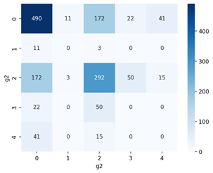

# TECHNIKI ANALIZY SIECI SPOŁECZNYCH

## Temat projektu

Porównanie cech sieciowych państw-węzłów w sieci przepływów finansowych lub towarowych z analogicznymi cechami w sieci organizacji międzynarodowych lub bilateralnych umów handlowych.

## 1. KONCEPCJA

### Sieć Przepływów Finansowych

Pierwszy zbiór danych został pobrany ze strony organizacji OECD (Organizacja Współpracy Gospodarczej i Rozwoju), która udostępnia szeroką gamę informacji o przepływach finansowych między państwami w wielu różnych kategoriach, m.in. bilanse płatnicze, międzynarodowe koszty transportu i ubezpieczenia w handlu towarami.

Na potrzeby naszego projektu wybraliśmy dane o międzynarodowym handlu usługami. Zorganizowane są one w formie tabeli [państwo członkowskie, państwo], w której wartości oznaczają bilans płatniczy w handlu usługami. Formalnie wskaźnik ten nosi nazwę EBOPS (Extended Balance of Payments Services Classification) i jest powszechnie stosowany w statystyce ekonomicznej. Wartości wyrażone są w milionach USD.

Warto zauważyć, że dane nie obejmują jedynie Państw przynależących do tej organizacji (państwa członkowskie), ale wszystkie z którymi utrzymują współpracę.

Zbiór danych nie obejmuje wszystkich możliwych przepływów finansowych, np. przemysł lub eksport towarów, natomiast ich znaczną część (usługi), co niesie dużo informacji o współpracy pomiędzy poszczególnymi państwami. Z perspektywy uwzględnienia drugiego zbioru danych o organizacjach międzynarodowych, umożliwi to ciekawe porównanie, czy wspólna przynależność do organizacji pokrywa się w jakiś sposób z przepływami finansowymi.

Sieć połączeń stworzona na podstawie tych danych będzie miała następującą postać:
- Węzłami są poszczególne państwa.
- Krawędzie reprezentują wzajemny transfer finansowy (nie pomiędzy wszystkimi państwami, on występuje).
- Waga krawędzi odpowiada liczbie przesyłanych środków (wartości będą odpowiednio znormalizowane).

*Fig. 1. Przykładowe wiersze ze zbioru danych OECD.*

### Sieć Organizacji Międzynarodowych

Zbiory danych IGO zawierają informacje o organizacjach międzynarodowych, których członkami są co najmniej 3 państwa, z lat 1815-2014. Dane IGO są gromadzone w odstępach 5-letnich w latach 1815-1965, a następnie corocznie.

Zbiór danych można pobrać jako jeden plik w formacie .csv ze strony Correlates of War. Dane są dostępne w formie tabelarycznej. Tabela w wierszach zawiera listę organizacji międzynarodowych, a w kolumnach listę państw. Wartości binarne 0/1 oznaczają brak przynależności/przynależność.

*Fig. 2. Przykładowe wiersze ze zbioru danych IGO.*

Taki zbiór danych przedstawia, jak silnie państwa są ze sobą powiązane w kontekście przynależności do tych samych organizacji, co może lub nie pokrywać się z ilością przepływów finansowych.

Dane pochodzą ze strony organizacji Correlates of War (studium działań wojennych). Mimo tematyki odchodzącej od ekonomii, organizacja udostępnia dane o przynależności do organizacji międzynarodowych, co również może być użyte w kontekście naszej analizy.

Sieć połączeń stworzona na podstawie tych danych będzie miała następującą postać:
- Węzłami są poszczególne państwa.
- Węzły są ze sobą połączone, jeżeli należą do tej samej organizacji.
- Waga krawędzi odpowiada liczbie wspólnych organizacji dla danej pary państw.

## 2. PRZYGOTOWANIE DANYCH
Po pobraniu danych wymagały one przygotowania, aby można było poddać je dalszej analizie. Wszystkie kroki można sprawdzić w [pliku](/DATA/dataset_processing.ipynb), który oryginalne pliki .csv przekształca w pliki gotowe do dalszych kroków poprzez następujące operacje:

Po pobraniu danych konieczne było ich przygotowanie, aby umożliwić dalszą analizę. Wszystkie kroki tego procesu można przeanalizować w pliku "dataset_processing.ipynb". Poniżej przedstawiamy główne etapy przekształceń danych:

1. **Filtrowanie kolumn:**
   W zbiorze przepływów finansowych pozostawiono wyłącznie konieczne kolumny: państwo X państwo Y suma przepływów

2. **Redukcja przepływów:**
   Aby uprościć analizę, zdecydowano się na redukcję przepływów. Na przykład, jeśli Austria przesyłała do Belgii 200 mln $, a jednocześnie Belgia przesyłała do Austrii 100 mln $, zachowano tylko jedno połączenie "Austria-Belgia" o wartości 300 mln $.

3. **Ujednolicenie nazw państw:**
   W celu spójności węzłów w obydwu sieciach przeprowadzono proces ujednolicenia nazw państw. Na przykład, "United States" zostało zamienione na "usa", a "SKorea" na "southkorea".

4. **Usunięcie państw występujących tylko w jednym zbiorze:**
   Wyeliminowano państwa, które występowały jedynie w jednym ze zbiorów danych. Przykładowo, zbiór przynależności do organizacji zawierał wiele państw, które już nie istnieją, takich jak Yugoslavia, USSR, West/East Germany.

5. **Przekształcenie zbioru danych organizacji:**
   Dane dotyczące przynależności do organizacji zostały przekształcone z postaci zerojedynkowej (fakt przynależności) w relację: państwo X państwo Y liczba wspólnych organizacji. To umożliwia stworzenie krawędzi ważonych wartością kolumny trzeciej pomiędzy poszczególnymi państwami (węzłami) - kolumny 1 i 2.

 

Dane dot. przepływów finansowych przed przygotowaniem: [FINANSES_original](/DATA/FINANSES_original.csv)

Dane dot. przepływów finansowych po przygotowaniu: [FINANSES_dataset](/DATA/FINANSES_dataset.csv)

Dane dot. organizacji przed przygotowaniem: [ORGANIZATIONS_original](/DATA/ORGANIZATIONS_original.csv)

Dane dot. organizacji po przygotowaniu: [ORGANIZATIONS_dataset](/DATA/ORGANIZATIONS_dataset.csv)

## 3. ANALIZA

Funkcje, za pomocą których została przeprowadzona analiza, znajdują się w [pliku](/DATA/clustering.ipynb).

### 3.1 KLASTROWANIE ALGOMERACYJNE

W zbiorze organizacji do tych samych klastrów należą głównie państwa z tych samych kontynentów - zwłaszcza w samych centrach skupisk. Na obrzeżach klastrów mogą znajdować się państwa-węzły z innych kontynentów, ale są one tak małe (z bardzo małą ilością przepływów), że można uznać to za szum (gdzieś musiały zostać dołączone).

Przykładem może być Somalia, która została dołączona do skupiska Bliskiego Wschodu, mimo że geograficznie leży bardzo blisko (od Jemenu dzieli ją jedynie zatoka Adeńska). W kontekście rysowania grafu widać, że Somalia leży w prawym górnym rogu klastra, niejako "przyciągana" przez klaster afrykański znajdujący się dalej w tym kierunku.

Warto zauważyć, że klastry oznaczone różnymi kolorami wykazują tendencję do gromadzenia państw z konkretnych regionów geograficznych, co ułatwia identyfikację geograficzną. Na przykład, szary klaster skupia państwa z Bliskiego Wschodu, czerwony głównie obejmuje państwa europejskie, zielony to państwa afrykańskie, a brązowy reprezentuje kraje Ameryki Południowej. Klaster pomarańczowy natomiast jest mieszanką państw z Ameryki Północnej, Azji i Oceanii.

Sieć organizacji jest grafem pełnym, ponieważ każdy kraj należy do przynajmniej jednej wspólnej organizacji z dowolnym innym krajem. Większość współprac to organizacje lokalne, począwszy od znanych Unia Europejska, Unia Afrykańska, Mercosur (Ameryka Południowa), po te mniejsze: Rada Nordycka, Beneluks, COPPPAL (Ameryka Łacińska).

*Fig. 3. Sieć organizacji międzynarodowych z podziałem na klastry.*

W zbiorze przepływów finansowych również widoczne są powiązania geograficzne, jednak są czasem "zdominowane" przez skalę wielkości finansów, co skutkuje obok siebie lądującymi gigantami, którzy niekoniecznie leżą na tym samym kontynencie.

Dobrym przykładem jest klaster fioletowy skupiający obok siebie: USA, Chiny, Japonię, Kanadę, Izrael, Koreę Północną czy Australię. Powiązania te są spowodowane stopniem rozwoju gospodarczego państw. Do tego klastra dołączają także Meksyk, Indonezja, Tajlandia, Indie czy Malezja - czyli powiązania geograficznie z wyżej wymienionymi gigantami.

W żółtym klastrze można zauważyć państwa Europy Środkowo-Wschodniej: Polska, Niemcy, Austria, Słowacja, Słowenia, Ukraina, Białoruś. Kraje na obrzeżach klastra (Laos, Sierra Leone) można uznać za szum lub pojedyncze duże współprace pomiędzy akurat tymi państwami.

W pozostałych skupiskach, ogólny podział geograficzny nie jest aż tak zauważalny, natomiast często węzły krajów sąsiadujących są blisko siebie: Portugalia, Francja, Włochy, Norwegia, Rosja, Litwa, Estonia, Finlandia.

*Fig. 4. Sieć przepływów finansowych z podziałem na klastry.*

W poniższej macierzy przedstawiono podobieństwo Jaccarda pomiędzy klastrami z sieci przepływów finansowych (g1) i sieci organizacji międzynarodowych (g2). Klastry 0,1,2 i 3 z sieci g2 posiadają swój podobny odpowiednik w grupie klastrów z sieci g1. Klaster 4 z sieci g2 jest natomiast podobny do dwóch klastrów z sieci g1. W tabeli przedstawiono też wybrane państwa wspólne między najbardziej podobnymi klastrami z g1 i g2. Klastry 4 i 5 z sieci g1 nie mają podobnego odpowiednika w sieci g2.

*Fig. 5. Macierz podobieństwa pomiędzy klastrami z różnych sieci.*

- Podobieństwo klastrów 0-0: głównie państwa europejskie
- Podobieństwo klastrów 1-1: głównie państwa afrykańskie
- Podobieństwo klastrów 2-2: głównie państwa Ameryki Południowej i Środkowej
- Podobieństwo klastrów 2-3: głównie państwa Azji
- Podobieństwo klastrów 0-4: głównie państwa bliskiego wschodu
- Podobieństwo klastrów 1-4: głównie państwa bliskiego wschodu

|          | g1 cluster 0 | g1 cluster 1 | g1 cluster 2 | g1 cluster 2 | g1 cluster 0 | g1 cluster 1 |
|----------|--------------|--------------|--------------|--------------|--------------|--------------|
| **g2 cluster 0** | lithuania    | cameroon     | china        | costarica    | lebanon      | jordan       |
| **g2 cluster 1** | moldova      | lesotho      | vietnam      | brazil       | somalia      | qatar        |
| **g2 cluster 2** | turkey       | burundi      | malaysia     | mexico       | mauritania   | algeria      |
| **g2 cluster 3** | northmacedonia| mozambique   | canada       | peru         | iraq         | kuwait       |
| **g2 cluster 4** | azerbaijan   | ethiopia     | indonesia    | -            | -            | -            |
| **g2 cluster 4** | dominicanrepublic| sudan      | comoros      | -            | -            | -            |
| ...      | ...          | ...          | ...          | ...          | ...          | ...          |

Da się zauważyć nieprzypadkowe podobieństwo pomiędzy niektórymi klastrami, co może wskazywać na to, że przynależność do organizacji wpływa na przepływy finansowe.

# Czy przynależność do organizacji wpływa na przepływy finansowe?

W poniższej macierzy przedstawiono średnie przepływy finansowe pomiędzy klastrami wyodrębnionymi na podstawie połączeń w organizacjach międzynarodowych. Średni przepływ pomiędzy klastrami X i Y jest zdefiniowany jako średnia arytmetyczna przepływów pomiędzy każdą możliwą unikalną parą państw (x, y), gdzie x jest państwem z klastra X, a y jest państwem z klastra Y. Cyfra 0 w macierzy oznacza brak danych. Dla klastrów 0 i 2 potwierdza się hipoteza, że państwa, które należą wspólnie do organizacji międzynarodowych mają pomiędzy sobą większy przepływ niż do innych państw. Dla klastrów 1,3 i 4, do których należą państwa Afryki, Azji wschodniej i Ameryki Południowej nie mieliśmy wystarczającej ilości danych, żeby zweryfikować lub wykluczyć hipotezę (przepływy wynoszą 0).

*Fig. 6. Średnie przepływy finansowe pomiędzy państwami z różnych klastrów wyodrębnionych na podstawie sieci organizacji międzynarodowych.*

|          | g1 cluster 0 | g1 cluster 1 | g1 cluster 2 | g1 cluster 2 | g1 cluster 0 | g1 cluster 1 |
|----------|--------------|--------------|--------------|--------------|--------------|--------------|
| **g2 cluster 0** | lithuania    | cameroon     | china        | costarica    | lebanon      | jordan       |
| **g2 cluster 1** | moldova      | lesotho      | vietnam      | brazil       | somalia      | qatar        |
| **g2 cluster 2** | turkey       | burundi      | malaysia     | mexico       | mauritania   | algeria      |
| **g2 cluster 3** | northmacedonia| mozambique   | canada       | peru         | iraq         | kuwait       |
| **g2 cluster 4** | azerbaijan   | ethiopia     | indonesia    | -            | -            | -            |
| **g2 cluster 4** | dominicanrepublic| sudan      | comoros      | -            | -            | -            |
| ...      | ...          | ...          | ...          | ...          | ...          | ...          |

Da się zauważyć nieprzypadkowe podobieństwo pomiędzy niektórymi klastrami, co może wskazywać na to, że przynależność do organizacji wpływa na przepływy finansowe.

## 3.2 ANALIZA RDZENI

Dla sieci przepływów finansowych wyznaczono rdzeń o najwyższym rzędzie, równym 31. Przeważająca część krajów wchodząca w jego skład to kraje europejskie oraz najważniejsze kraje świata: USA, Kanada, Chiny itp. Jedynym wyróżniającym się członkiem w tym zestawieniu jest Korea Północna, posiadająca 31 połączeń finansowych z innymi krajami tego zestawienia.

Obserwacja ta jest niezmiernie ciekawa, głównie z powodu ilości sankcji jakimi jest objęty ten kraj. Co jeszcze bardziej interesujące, w pierwotnej sieci organizacji, węzeł odpowiadający Korei Północnej również jest stopnia 31 - Korea Posiada posiada połączenia finansowe jedynie z krajami wchodzącymi w skład rdzenia o najwyższym rzędzie.

W przypadku sieci organizacji analiza rdzeni nie przynosiła dodatkowych informacji - sieć jest grafem pełnym. Z tego powodu zbadano sieć powstałą po usunięciu połączeń między krajami, które uczestniczą wspólnie w mniejszej ilości organizacji niż 50. Rdzeń o najwyższym rzędzie (k = 37) prezentuje się następująco:

Wszystkie kraje wchodzące w skład rdzenia są tego samego - maksymalnego stopnia, równego 37. Dodatkowo przedstawiony podgraf jest kliką, każdy kraj jest powiązany z innym, członkostwem w pewnej organizacji. Możemy zauważyć, że w skład zaprezentowanej sieci wchodzą w większości kraje afrykańskie - tzw. kraje rozwijające się.

Analiza stopni wierzchołków przedstawionych krajów w oryginalnej sieci wskazuje trzy kraje - liderów: Tunezja (stopień = 82), Egipt (stopień=80), RPA (stopień=79). Pokrywa się to z faktem, że wskazane kraje są jednymi z najlepiej rozwiniętych w Afryce. Wniosek ten można również potwierdzić sumując przepływy finansowe poszczególnych krajów afrykańskich. Pod takim względem pierwszy jest Egipt (6995.8 mln USD), drugie RPA (6202.2 mln USD) a Tunezja zajmuje piąte miejsce w tym zestawieniu (3681.1 mln USD).

## 3.3 WSKAŹNIKI LICZBOWE

| WSKAŹNIK                                          | PRZEPŁYWY FINANSOWE | ORGANIZACJE | ORGANIZACJE (filtracja > 50)  |
|---------------------------------------------------|---------------------|-------------|-------------------------------|
| Przechodniość (Globalny współczynnik gronowania)  | 0.35                | 1.0         | 0.69                          |
| Uśredniony lokalny współczynnik gronowania        | 0.89                | 1.0         | 0.77                          |
| Gęstość                                           | 0.195               | 1.0         | 0.24                          |
| Asortatywność (numeric_assortativity_coefficient) | -0.73               | nan         | 0.22                          |

  
+ ### Globalny oraz uśredniony lokalny współczynnik gronowania

Wartość tych wskaźników w zbiorze danych organizacji jest dużo wyższa, dlatego że każde państwo przynależy do przynajmniej jednej wspólnej organizacji z innym państwem - jest to przechodniość maksymalna. Po odrzuceniu powiązań mniejszych niż 50, naturalnie będzie ona trochę niższa, ale nadal na wysokim poziomie. Można z tego wnioskować, że państwa, które już są aktywne we współpracy, mają tendencję do utrzymywania i rozwijania więzi, wchodząc w nowe kolaboracje. To zjawisko jest znane w teorii sieci jako preferencyjne przyłączanie się do węzłów o większym stopniu węzła (w tym przypadku, większej aktywności współpracy).

W kontekście sieci przepływów finansowych, gęstość krawędzi w sieci jest umiarkowana, co oznacza, że istnieje wiele niepołączonych węzłów. Jednakże, w miarę eliminacji słabych powiązań, na przykład z państwami o niewielkich zasobach finansowych, takimi jak Saint Kitts i Nevis czy Antigua i Barbuda, które nie odgrywają dominującej roli w sektorze usług finansowych, wartość przechodniości rośnie. To potwierdza, że państwa o niskich zasobach finansowych zazwyczaj nie posiadają wielu umów finansowych i często polegają na współpracy z pojedynczymi dominującymi graczami, w tym przypadku, z USA.

W skrócie, w analizie sieci przepływów finansowych nie występują państwa, które mają jedynie pojedyncze, ale relatywnie duże współprace. Zazwyczaj, jeśli państwo operuje na wysokich wartościach, to równocześnie posiada wiele współprac, co może sugerować, że istnieją silne powiązania z różnymi partnerami.

+ ### Gęstość

Po usunięciu krawędzi w grafie organizacji, świadczących o współwystępowaniu pary państw w poniżej 50 organizacjach, gęstość grafu spadła do poziomu zbliżonego do gęstości w grafie przepływów finansowych. Oznacza to, że nałożenie wspomnianego filtra “zbliżyło” obie sieci w sensie ilości połączeń między węzłami. W obydwu dominują połączenia między państwami o wysokim rozwoju gospodarczym i dużych rozmiarach. Można to interpretować jako potwierdzenie hipotezy, że geografia ma istotny wpływ na współpracę międzynarodową.

+ ### Asortatywność

Analiza asortatywności w przypadku przepływów finansowych świadczy o dysasortatywności tej sieci. Kraje o wysokim stopniu mają tendencję do tworzenia połączeń z krajami o małym stopniu - znaczące kraje często inwestują w biedniejsze/rozwijające się państwa. W przypadku sieci organizacji, wskaźnik asortatywności jest niski, może to potwierdzać tezę, że geografia ma istotny wpływ na współpracę międzynarodową, bardziej znaczący niż np. zamożność państwa (kraje afrykańskie).

## 4. PODSUMOWANIE

Analiza sieci przepływów finansowych oraz sieci organizacji uwydatniła istotne zależności, które korespondują z położeniem geograficznym poszczególnych państw. Obie te struktury wyraźnie odzwierciedlają wpływ geografii na dynamikę relacji międzynarodowych. Organizacje międzynarodowe często opierają się o położenie geograficzne (Unia Europejska, Unia Afrykańska). W kontekście przepływów finansowych widoczna jest tendencja do współpracy między krajami leżącymi blisko siebie, jednak ten efekt jest wyraźnie przytłumiony przez współpracę między gigantami gospodarczymi. Analiza rzuca także światło na wspólne cechy obu sieci, wskazujące np. wyróżniających liderów na kontynencie afrykańskim, którzy należą do wielu organizacji oraz wymieniają relatywnie dużą ilość finansów z innymi państwami.

Podsumowując, przeprowadzona analiza uwidoczniła pewne zależności między współwystępowaniem krajów w organizacjach międzynarodowych a przepływem pieniędzy. Niemniej jednak wpływ organizacji można by ocenić jeszcze lepiej w kontekście konkretnych zastosowań, np. podziału danych na organizacje dotyczące żywności i wyodrębnienie organizacji o tej samej gałęzi przemysłu.

